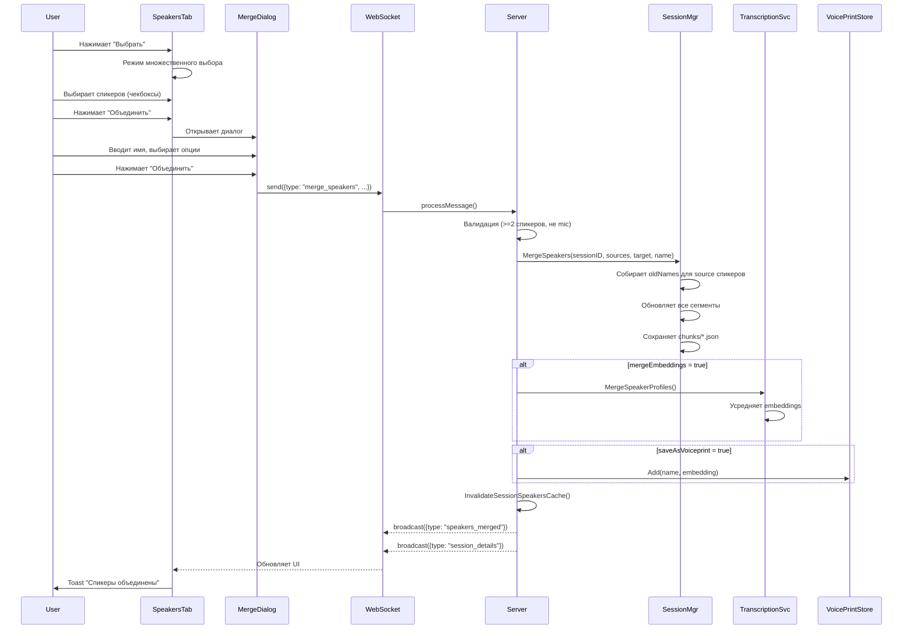

# Архитектура: Объединение спикеров (Merge Speakers)

**Дата:** 2025-12-14 15:30
**Статус:** Draft
**Архитектор:** @architect
**На основе анализа:** Текущая архитектура voiceprint/session

---

## Контекст проблемы

Диаризация (определение спикеров) иногда разбивает одного человека на несколько "спикеров":
- Пользователь видит 5 спикеров вместо 2 (Вы + 1 собеседник)
- Причины: изменение тембра голоса, шумы, паузы, ошибки модели
- Нужна возможность указать системе, что несколько спикеров - это один человек

---

## ADR (Architecture Decision Record)

### Ключевые решения

| Решение | Альтернативы | Обоснование | Последствия |
|---------|--------------|-------------|-------------|
| Объединение на уровне сессии | Глобальное объединение voiceprints | Пользователь может хотеть разное объединение в разных сессиях | Требуется повторное объединение в каждой сессии |
| Переименование сегментов in-place | Создание mapping таблицы | Простота реализации, совместимость с существующим кодом | Необратимая операция (но можно ретранскрибировать) |
| Усреднение embeddings опционально | Всегда усреднять / Всегда брать от target | Гибкость для пользователя | Дополнительный UI элемент |
| WebSocket API | REST API | Консистентность с существующим API, real-time обновления | - |

---

## Архитектурные диаграммы

### Component Diagram

```
┌─────────────────────────────────────────────────────────────────────┐
│                           Frontend                                   │
├─────────────────────────────────────────────────────────────────────┤
│  ┌─────────────────┐    ┌─────────────────┐    ┌─────────────────┐  │
│  │  SpeakersTab    │───▶│  MergeDialog    │───▶│ SessionContext  │  │
│  │  (selection)    │    │  (UI)           │    │ (mergeSpeakers) │  │
│  └─────────────────┘    └─────────────────┘    └────────┬────────┘  │
│                                                          │           │
│                                                          ▼           │
│                                               ┌─────────────────┐    │
│                                               │  useWebSocket   │    │
│                                               │  (send/receive) │    │
│                                               └────────┬────────┘    │
└────────────────────────────────────────────────────────┼────────────┘
                                                         │ WebSocket
                                                         ▼
┌─────────────────────────────────────────────────────────────────────┐
│                           Backend                                    │
├─────────────────────────────────────────────────────────────────────┤
│  ┌─────────────────┐                                                 │
│  │  api/server.go  │◀── "merge_speakers" message                     │
│  │  processMessage │                                                 │
│  └────────┬────────┘                                                 │
│           │                                                          │
│           ▼                                                          │
│  ┌─────────────────┐    ┌─────────────────┐    ┌─────────────────┐  │
│  │ session/manager │───▶│ TranscriptionSvc│───▶│ voiceprint/store│  │
│  │ MergeSpeakers() │    │ MergeProfiles() │    │ (optional save) │  │
│  └─────────────────┘    └─────────────────┘    └─────────────────┘  │
│                                                                      │
│  Storage:                                                            │
│  ┌─────────────────┐    ┌─────────────────┐                         │
│  │ chunks/*.json   │    │ speakers.json   │                         │
│  │ (segments)      │    │ (voiceprints)   │                         │
│  └─────────────────┘    └─────────────────┘                         │
└─────────────────────────────────────────────────────────────────────┘
```

### Sequence Diagram - Merge Speakers Flow



---

## API Контракты

### WebSocket Messages

#### Request: merge_speakers

```typescript
interface MergeSpeakersRequest {
  type: "merge_speakers";
  sessionId: string;           // UUID сессии
  sourceSpeakerIds: number[];  // LocalIDs спикеров для объединения (минимум 2)
  targetSpeakerId: number;     // LocalID целевого спикера (должен быть в sourceSpeakerIds)
  newName?: string;            // Новое имя (опционально, иначе берётся от target)
  mergeEmbeddings: boolean;    // true = усреднить, false = взять от target
  saveAsVoiceprint: boolean;   // Сохранить в глобальную базу
}
```

#### Response: speakers_merged

```typescript
interface SpeakersMergedResponse {
  type: "speakers_merged";
  sessionId: string;
  mergedCount: number;         // Количество объединённых спикеров
  targetSpeakerId: number;
  newName: string;             // Итоговое имя
  voiceprintId?: string;       // UUID если saveAsVoiceprint=true
}
```

#### Error Response

```typescript
interface ErrorResponse {
  type: "error";
  data: string;  // Текст ошибки
}
```

**Возможные ошибки:**
- `"Cannot merge: at least 2 speakers required"`
- `"Cannot merge: target speaker must be in source list"`
- `"Cannot merge: cannot merge mic speaker with others"`
- `"Session not found: {sessionId}"`

### Расширение Message struct (api/server.go)

```go
type Message struct {
    // ... существующие поля ...
    
    // Merge Speakers
    SourceSpeakerIDs  []int  `json:"sourceSpeakerIds,omitempty"`
    TargetSpeakerID   int    `json:"targetSpeakerId,omitempty"`
    MergeEmbeddings   bool   `json:"mergeEmbeddings,omitempty"`
    MergedCount       int    `json:"mergedCount,omitempty"`
}
```

---

## Модель данных

### Существующие сущности (без изменений)

```go
// session/types.go
type TranscriptSegment struct {
    Start   int64  `json:"start"`   // ms
    End     int64  `json:"end"`     // ms
    Text    string `json:"text"`
    Speaker string `json:"speaker"` // Это поле обновляется при merge
    // ...
}

// voiceprint/types.go
type SessionSpeaker struct {
    LocalID       int       `json:"localId"`
    DisplayName   string    `json:"displayName"`
    Embedding     []float32 `json:"embedding"`
    IsRecognized  bool      `json:"isRecognized"`
    IsMic         bool      `json:"isMic"`
    SegmentCount  int       `json:"segmentCount"`
    TotalDuration float32   `json:"totalDuration"`
    // ...
}
```

### Логика маппинга LocalID -> Speaker Names

```
LocalID -1 (mic):     ["Вы", "mic"]
LocalID 0:            ["Speaker 0", "Собеседник 1", "sys", "Собеседник", <custom>]
LocalID 1:            ["Speaker 1", "Собеседник 2", <custom>]
LocalID N:            ["Speaker N", "Собеседник N+1", <custom>]
```

---

## Алгоритм объединения

### Псевдокод

```
FUNCTION MergeSpeakers(sessionID, sourceLocalIDs[], targetLocalID, newName, mergeEmbeddings):
  
  // 1. VALIDATION
  IF len(sourceLocalIDs) < 2:
    RETURN error("at least 2 speakers required")
  
  IF targetLocalID NOT IN sourceLocalIDs:
    RETURN error("target speaker must be in source list")
  
  IF -1 IN sourceLocalIDs:
    RETURN error("cannot merge mic speaker with others")
  
  // 2. DETERMINE TARGET NAME
  IF newName != "":
    finalName = newName
  ELSE:
    finalName = GetDisplayName(sessionID, targetLocalID)
  
  // 3. COLLECT OLD NAMES TO REPLACE
  oldNames = []
  FOR EACH localID IN sourceLocalIDs:
    IF localID != targetLocalID:
      names = GetAllPossibleNames(sessionID, localID)
      oldNames.extend(names)
  
  // 4. UPDATE ALL SEGMENTS
  session = GetSession(sessionID)
  FOR EACH chunk IN session.Chunks:
    modified = false
    
    FOR EACH segment IN chunk.Dialogue:
      IF segment.Speaker IN oldNames:
        segment.Speaker = finalName
        modified = true
    
    FOR EACH segment IN chunk.SysSegments:
      IF segment.Speaker IN oldNames:
        segment.Speaker = finalName
        modified = true
    
    IF modified:
      SaveChunk(chunk)
  
  // 5. MERGE EMBEDDINGS (optional)
  IF mergeEmbeddings:
    embeddings = []
    FOR EACH localID IN sourceLocalIDs:
      emb = GetSpeakerEmbedding(sessionID, localID)
      IF emb != nil AND len(emb) > 0:
        embeddings.append(emb)
    
    IF len(embeddings) > 1:
      mergedEmbedding = AverageAndNormalize(embeddings)
      UpdateSpeakerProfile(sessionID, targetLocalID, mergedEmbedding, finalName)
  ELSE:
    // Просто обновляем имя в профиле target
    UpdateSpeakerProfileName(sessionID, targetLocalID, finalName)
  
  // 6. CLEANUP SOURCE PROFILES
  FOR EACH localID IN sourceLocalIDs:
    IF localID != targetLocalID:
      DeleteSpeakerProfile(sessionID, localID)
  
  // 7. INVALIDATE CACHE
  InvalidateSessionSpeakersCache(sessionID)
  
  RETURN success(mergedCount: len(sourceLocalIDs))
```

### Функция усреднения embeddings

```go
func AverageEmbeddings(embeddings [][]float32) []float32 {
    if len(embeddings) == 0 {
        return nil
    }
    
    dim := len(embeddings[0]) // 256 для WeSpeaker
    result := make([]float32, dim)
    
    // Суммируем
    for _, emb := range embeddings {
        for i := 0; i < dim; i++ {
            result[i] += emb[i]
        }
    }
    
    // Усредняем
    n := float32(len(embeddings))
    for i := 0; i < dim; i++ {
        result[i] /= n
    }
    
    // L2 нормализация
    return NormalizeVector(result)
}
```

---

## UI Design

### Режим выбора спикеров

**Состояние SpeakersTab:**
```typescript
interface SpeakersTabState {
  isSelectionMode: boolean;
  selectedSpeakerIds: Set<number>;
}
```

**Изменения в UI:**

1. **Header с кнопкой "Выбрать":**
```
┌─────────────────────────────────────────┐
│ 👥 3 спикеров              [Выбрать]    │
└─────────────────────────────────────────┘
```

2. **Режим выбора (isSelectionMode=true):**
```
┌─────────────────────────────────────────┐
│ 👥 Выбрано: 2               [Отмена]    │
├─────────────────────────────────────────┤
│ ☐ 🟢 Вы           (disabled)            │
│    5 фраз · 1м 23с                      │
├─────────────────────────────────────────┤
│ ☑ 🔵 Собеседник 1                       │
│    12 фраз · 3м 45с                     │
├─────────────────────────────────────────┤
│ ☑ 🟣 Собеседник 2                       │
│    8 фраз · 2м 10с                      │
├─────────────────────────────────────────┤
│ ☐ 🟠 Собеседник 3                       │
│    3 фразы · 45с                        │
├─────────────────────────────────────────┤
│         [Объединить (2)]                │
└─────────────────────────────────────────┘
```

### Диалог объединения (MergeDialog)

```
┌─────────────────────────────────────────┐
│  Объединить спикеров                  ✕ │
├─────────────────────────────────────────┤
│                                         │
│  Выбрано: Собеседник 1, Собеседник 2    │
│                                         │
│  Имя объединённого спикера:             │
│  ┌─────────────────────────────────┐    │
│  │ Иван                            │    │
│  └─────────────────────────────────┘    │
│                                         │
│  Голосовой отпечаток:                   │
│  ○ Взять от: [Собеседник 1 ▼]           │
│  ● Усреднить голоса всех спикеров       │
│                                         │
│  ☐ Запомнить голос для будущих сессий   │
│                                         │
├─────────────────────────────────────────┤
│              [Отмена]  [Объединить]     │
└─────────────────────────────────────────┘
```

### Props для MergeDialog

```typescript
interface MergeDialogProps {
  speakers: SessionSpeaker[];      // Выбранные спикеры
  onMerge: (params: {
    targetSpeakerId: number;
    newName: string;
    mergeEmbeddings: boolean;
    saveAsVoiceprint: boolean;
  }) => void;
  onClose: () => void;
}
```

---

## Нефункциональные требования

### Производительность

| Метрика | Целевое значение | Примечание |
|---------|------------------|------------|
| Время объединения | < 500ms | Для сессии до 100 чанков |
| Размер WebSocket сообщения | < 1KB | Без полной сессии в response |
| Обновление UI | < 100ms | После получения speakers_merged |

### Надёжность

- **Атомарность:** Все сегменты обновляются в одной транзакции
- **Откат:** При ошибке сохранения - не применять частичные изменения
- **Идемпотентность:** Повторный merge тех же спикеров - no-op

### Безопасность

- Валидация sessionID (существует, принадлежит пользователю)
- Валидация localSpeakerIds (существуют в сессии)
- Санитизация newName (trim, max length 100)

---

## Observability

### Логирование

```go
log.Printf("MergeSpeakers: session=%s, sources=%v, target=%d, name=%s",
    sessionID[:8], sourceLocalIDs, targetLocalID, newName)

log.Printf("MergeSpeakers: updated %d segments in %d chunks",
    updatedSegments, updatedChunks)

log.Printf("MergeSpeakers: merged embeddings from %d speakers",
    len(embeddings))
```

### Метрики (будущее)

- `speakers_merged_total` - счётчик объединений
- `speakers_merged_duration_ms` - время выполнения
- `speakers_merged_count` - histogram количества объединяемых спикеров

---

## Архитектурные риски

| Риск | Вероятность | Влияние | Митигация |
|------|-------------|---------|-----------|
| Потеря данных при ошибке сохранения | Low | High | Транзакционное обновление, backup перед merge |
| Некорректное усреднение embeddings | Medium | Medium | Опция выбора embedding от конкретного спикера |
| Путаница с именами спикеров | Medium | Low | Показывать preview результата в диалоге |
| Производительность на больших сессиях | Low | Medium | Batch обновление, progress indicator |

---

## Рекомендации для реализации

### Для @planner

**Области для декомпозиции:**
1. Backend: MergeSpeakers в session/manager.go (2-3 часа)
2. Backend: WebSocket handler в api/server.go (1-2 часа)
3. Frontend: Selection mode в SpeakersTab (2-3 часа)
4. Frontend: MergeDialog компонент (2-3 часа)
5. Frontend: Integration с WebSocket (1 час)
6. Testing: Unit + E2E (2-3 часа)

**Приоритеты:**
1. Базовый merge без embeddings (MVP)
2. Усреднение embeddings
3. Сохранение в voiceprint store
4. UI polish

### Для @coder

**Файлы для изменения:**
```
backend/
  session/manager.go          # +MergeSpeakers()
  internal/api/server.go      # +case "merge_speakers"
  internal/service/transcription.go  # +MergeSpeakerProfiles()

frontend/
  src/components/modules/SpeakersTab.tsx  # Selection mode
  src/components/modules/MergeDialog.tsx  # NEW
  src/context/SessionContext.tsx          # +mergeSpeakers()
  src/hooks/useWebSocket.ts               # +speakers_merged handler
  src/types/voiceprint.ts                 # +MergeSpeakersRequest
```

**Conventions:**
- Использовать существующий паттерн WebSocket messages
- Следовать стилю кода в SpeakersTab (inline styles)
- Логировать все операции с `log.Printf`

### Для @tester

**Ключевые сценарии:**
1. Объединение 2 спикеров с новым именем
2. Объединение 3+ спикеров
3. Объединение с сохранением в voiceprint
4. Попытка объединить mic с sys (должна быть ошибка)
5. Попытка объединить 1 спикера (должна быть ошибка)
6. Объединение в сессии с 50+ чанками (производительность)

**NFR для проверки:**
- Время объединения < 500ms
- UI обновляется без перезагрузки страницы
- После объединения статистика корректна

---

## Appendix: Существующий код для референса

### Текущий rename_session_speaker handler

```go
case "rename_session_speaker":
    if msg.SessionID == "" || msg.SpeakerName == "" {
        send(Message{Type: "error", Data: "sessionId and speakerName are required"})
        return
    }
    if err := s.renameSpeakerInSession(msg.SessionID, msg.LocalSpeakerID, msg.SpeakerName); err != nil {
        send(Message{Type: "error", Data: err.Error()})
        return
    }
    s.invalidateSessionSpeakersCache(msg.SessionID)
    // ... broadcast updates
```

### Текущий UpdateSpeakerName в session/manager.go

```go
func (m *Manager) UpdateSpeakerName(sessionID string, oldName, newName string) error {
    // Обновляет имя спикера во всех чанках
    for _, chunk := range session.Chunks {
        for i := range chunk.Dialogue {
            if chunk.Dialogue[i].Speaker == oldName {
                chunk.Dialogue[i].Speaker = newName
                modified = true
            }
        }
        // ... SysSegments, MicSegments
    }
}
```

Этот метод можно переиспользовать для merge, вызывая его для каждого oldName.
