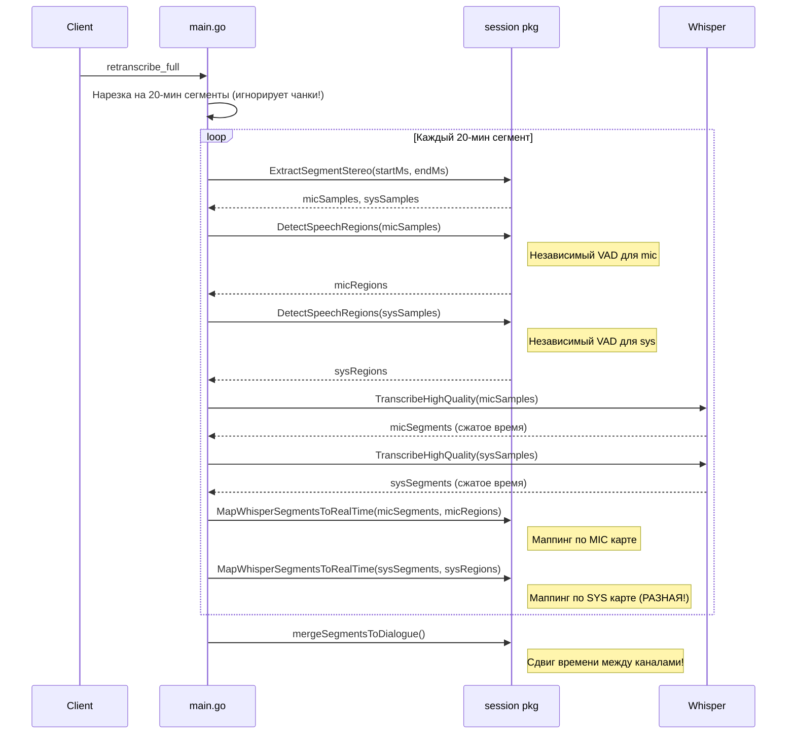
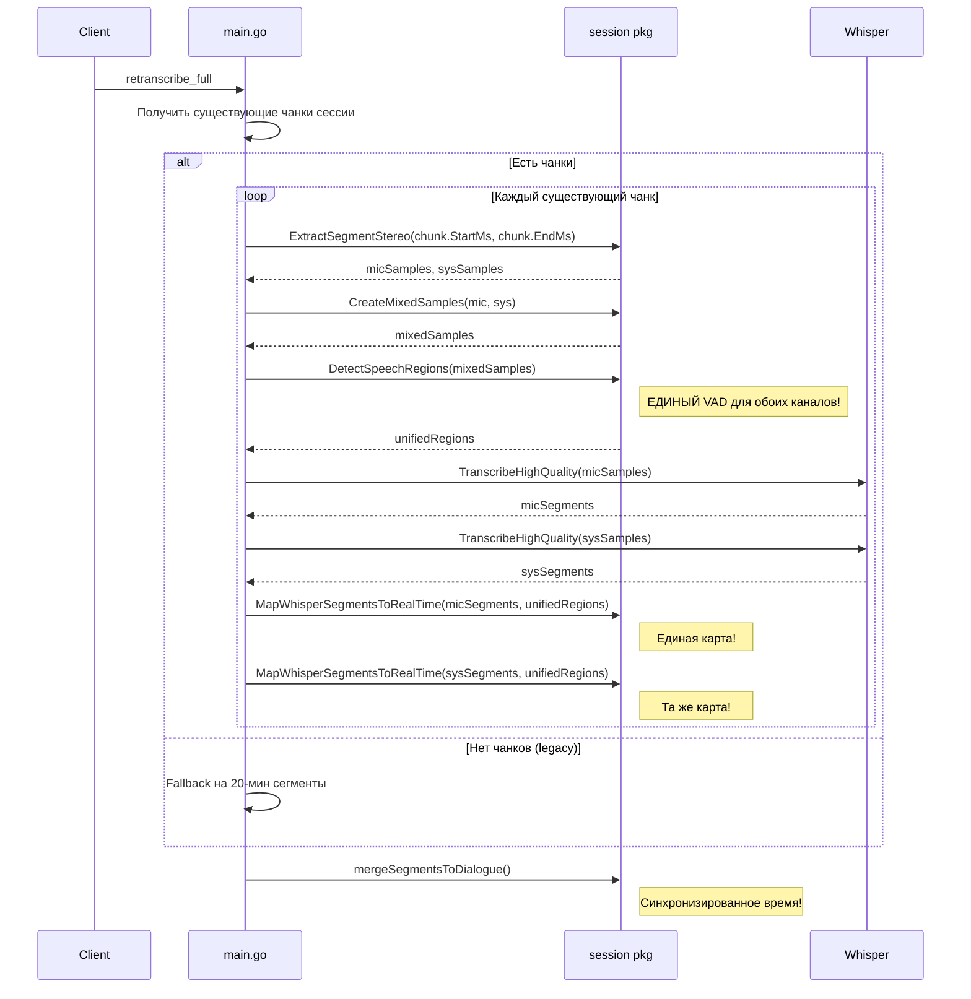

# Архитектура: Улучшение полной ретранскрипции с использованием существующих чанков

**Дата:** 2025-12-03 14:30
**Статус:** Draft
**Архитектор:** @architect
**Задача:** Рефакторинг `retranscribe_full` для использования существующих чанков и синхронизации времени между каналами

---

## Анализ текущей проблемы

### Проблема 1: Игнорирование существующих чанков

**Текущее поведение** (main.go:1334-1360):
```go
const maxSegmentDurationMs int64 = 20 * 60 * 1000 // 20 минут
numSegments := int((totalDurationMs + maxSegmentDurationMs - 1) / maxSegmentDurationMs)
for segIdx := 0; segIdx < numSegments; segIdx++ {
    segStartMs := int64(segIdx) * maxSegmentDurationMs
    segEndMs := segStartMs + maxSegmentDurationMs
    // ... нарезка по фиксированным 20-минутным интервалам
}
```

**Проблема:**
- Игнорируются существующие чанки сессии (`sess.Chunks`), которые уже нарезаны по VAD
- Каждый чанк имеет `StartMs`, `EndMs` и был создан с учётом пауз в речи
- Фиксированная нарезка по 20 минут может разрезать слова/фразы посередине

### Проблема 2: Независимый VAD для каналов

**Текущее поведение** (main.go:1404-1406):
```go
micRegions := session.DetectSpeechRegions(micSamples, session.WhisperSampleRate)
sysRegions := session.DetectSpeechRegions(sysSamples, session.WhisperSampleRate)
```

**Проблема:**
- VAD применяется к mic и sys каналам **независимо**
- Каждый канал получает свою "карту времени" (speech regions)
- При маппинге Whisper timestamps на реальное время используются разные карты
- Результат: сдвиг времени между каналами при объединении в диалог

**Пример проблемы:**
```
Mic: речь 0-5с, пауза 5-10с, речь 10-15с
Sys: пауза 0-3с, речь 3-12с, пауза 12-15с

Mic VAD regions: [{0-5000ms}, {10000-15000ms}]
Sys VAD regions: [{3000-12000ms}]

Whisper для mic вернёт timestamps 0-10с (сжатое время без пауз)
Whisper для sys вернёт timestamps 0-9с (сжатое время)

При маппинге обратно - разные карты дают разные результаты!
```

---

## ADR (Architecture Decision Record)

### Ключевые решения

| Решение | Альтернативы | Обоснование | Последствия |
|---------|--------------|-------------|-------------|
| **1. Использовать существующие чанки сессии** | a) Оставить 20-мин нарезку; b) Перенарезать с новым VAD | Чанки уже оптимально нарезаны по VAD при записи, содержат границы на паузах | Меньше работы, лучшее качество границ, сохранение контекста |
| **2. Единая временная шкала для обоих каналов** | a) Независимый VAD; b) VAD только по одному каналу | Синхронизация времени критична для диалога | Требует рефакторинга VAD логики |
| **3. VAD по объединённому сигналу (mic+sys)** | a) VAD по mic; b) VAD по sys; c) Пересечение регионов | Объединённый сигнал содержит речь обоих участников | Единая карта времени для обоих каналов |
| **4. Fallback на 20-мин сегменты если нет чанков** | Всегда требовать чанки | Обратная совместимость со старыми сессиями | Два пути выполнения |

---

## Архитектурные диаграммы

### Sequence Diagram: Текущий флоу (проблемный)



### Sequence Diagram: Предлагаемый флоу



### Component Diagram

```
┌─────────────────────────────────────────────────────────────────┐
│                         main.go                                  │
│  ┌─────────────────────────────────────────────────────────┐    │
│  │              retranscribe_full handler                   │    │
│  │  ┌─────────────────┐  ┌─────────────────────────────┐   │    │
│  │  │ ChunkIterator   │  │ SegmentIterator (fallback)  │   │    │
│  │  │ (использует     │  │ (20-мин нарезка)            │   │    │
│  │  │  sess.Chunks)   │  │                             │   │    │
│  │  └────────┬────────┘  └─────────────┬───────────────┘   │    │
│  │           │                         │                    │    │
│  │           └──────────┬──────────────┘                    │    │
│  │                      ▼                                   │    │
│  │  ┌─────────────────────────────────────────────────┐    │    │
│  │  │         TranscribeChunkStereo()                  │    │    │
│  │  │  - ExtractSegmentStereo                          │    │    │
│  │  │  - CreateUnifiedVADRegions (NEW!)                │    │    │
│  │  │  - TranscribeHighQuality (mic)                   │    │    │
│  │  │  - TranscribeHighQuality (sys)                   │    │    │
│  │  │  - MapToRealTime (unified regions)               │    │    │
│  │  └─────────────────────────────────────────────────┘    │    │
│  └─────────────────────────────────────────────────────────┘    │
└─────────────────────────────────────────────────────────────────┘

┌─────────────────────────────────────────────────────────────────┐
│                      session/vad.go                              │
│  ┌─────────────────────────────────────────────────────────┐    │
│  │  DetectSpeechRegions(samples) []SpeechRegion            │    │
│  │  - Существующая функция, без изменений                  │    │
│  └─────────────────────────────────────────────────────────┘    │
│  ┌─────────────────────────────────────────────────────────┐    │
│  │  CreateUnifiedSpeechRegions(mic, sys) []SpeechRegion    │    │  NEW!
│  │  - Создаёт микс mic+sys                                 │    │
│  │  - Вызывает DetectSpeechRegions на миксе                │    │
│  │  - Возвращает единую карту для обоих каналов            │    │
│  └─────────────────────────────────────────────────────────┘    │
└─────────────────────────────────────────────────────────────────┘
```

---

## Детальный план изменений

### Файл 1: `backend/session/vad.go`

**Добавить новую функцию:**

```go
// CreateUnifiedSpeechRegions создаёт единую карту речевых регионов для обоих каналов
// Используется для синхронизации timestamps между mic и sys при ретранскрипции
func CreateUnifiedSpeechRegions(micSamples, sysSamples []float32, sampleRate int) []SpeechRegion {
    // Создаём микс обоих каналов
    minLen := len(micSamples)
    if len(sysSamples) < minLen {
        minLen = len(sysSamples)
    }
    
    if minLen == 0 {
        return nil
    }
    
    mixedSamples := make([]float32, minLen)
    for i := 0; i < minLen; i++ {
        // Берём максимум амплитуд (OR логика) вместо среднего
        // Это гарантирует что речь любого участника будет обнаружена
        micAbs := micSamples[i]
        if micAbs < 0 {
            micAbs = -micAbs
        }
        sysAbs := sysSamples[i]
        if sysAbs < 0 {
            sysAbs = -sysAbs
        }
        
        if micAbs > sysAbs {
            mixedSamples[i] = micSamples[i]
        } else {
            mixedSamples[i] = sysSamples[i]
        }
    }
    
    log.Printf("CreateUnifiedSpeechRegions: created mix of %d samples", minLen)
    
    return DetectSpeechRegions(mixedSamples, sampleRate)
}
```

### Файл 2: `backend/main.go` (case "retranscribe_full")

**Изменения в стерео режиме (строки ~1337-1505):**

```go
if isStereo {
    // НОВЫЙ КОД: Используем существующие чанки если они есть
    chunks := sess.Chunks
    useExistingChunks := len(chunks) > 0 && chunks[0].StartMs >= 0 && chunks[0].EndMs > 0
    
    if useExistingChunks {
        log.Printf("Using %d existing chunks for retranscription", len(chunks))
        
        var allMicSegments, allSysSegments []ai.TranscriptSegment
        
        for chunkIdx, chunk := range chunks {
            log.Printf("Processing chunk %d/%d: %d-%d ms (%.1f sec)",
                chunkIdx+1, len(chunks), chunk.StartMs, chunk.EndMs,
                float64(chunk.EndMs-chunk.StartMs)/1000)
            
            // Прогресс
            progress := float64(chunkIdx) / float64(len(chunks))
            conn.WriteJSON(Message{
                Type:      "full_transcription_progress",
                SessionID: sess.ID,
                Progress:  progress,
                Data:      fmt.Sprintf("Обработка чанка %d/%d...", chunkIdx+1, len(chunks)),
            })
            
            // Извлекаем аудио чанка
            micSamples, sysSamples, err := session.ExtractSegmentStereo(
                mp3Path, chunk.StartMs, chunk.EndMs, session.WhisperSampleRate)
            if err != nil {
                log.Printf("Failed to extract chunk %d: %v", chunkIdx+1, err)
                continue
            }
            
            // КЛЮЧЕВОЕ ИЗМЕНЕНИЕ: Единый VAD для обоих каналов
            unifiedRegions := session.CreateUnifiedSpeechRegions(
                micSamples, sysSamples, session.WhisperSampleRate)
            log.Printf("Chunk %d: unified VAD found %d regions", chunkIdx+1, len(unifiedRegions))
            
            // Транскрипция микрофона
            micSegments, micErr := engine.TranscribeHighQuality(micSamples)
            if micErr != nil {
                log.Printf("Chunk %d mic transcription error: %v", chunkIdx+1, micErr)
            } else if len(micSegments) > 0 && len(unifiedRegions) > 0 {
                // Маппим на реальное время с ЕДИНОЙ картой
                whisperStarts := make([]int64, len(micSegments))
                for i, seg := range micSegments {
                    whisperStarts[i] = seg.Start
                }
                realStarts := session.MapWhisperSegmentsToRealTime(whisperStarts, unifiedRegions)
                for i := range micSegments {
                    duration := micSegments[i].End - micSegments[i].Start
                    micSegments[i].Start = realStarts[i] + chunk.StartMs  // offset чанка
                    micSegments[i].End = realStarts[i] + chunk.StartMs + duration
                    // Маппим слова
                    for j := range micSegments[i].Words {
                        wordDuration := micSegments[i].Words[j].End - micSegments[i].Words[j].Start
                        mappedStart := session.MapWhisperTimeToRealTime(
                            micSegments[i].Words[j].Start, unifiedRegions)
                        micSegments[i].Words[j].Start = mappedStart + chunk.StartMs
                        micSegments[i].Words[j].End = mappedStart + chunk.StartMs + wordDuration
                    }
                }
                allMicSegments = append(allMicSegments, micSegments...)
            }
            
            // Транскрипция системного звука (аналогично, с той же unifiedRegions)
            sysSegments, sysErr := engine.TranscribeHighQuality(sysSamples)
            if sysErr != nil {
                log.Printf("Chunk %d sys transcription error: %v", chunkIdx+1, sysErr)
            } else if len(sysSegments) > 0 && len(unifiedRegions) > 0 {
                whisperStarts := make([]int64, len(sysSegments))
                for i, seg := range sysSegments {
                    whisperStarts[i] = seg.Start
                }
                realStarts := session.MapWhisperSegmentsToRealTime(whisperStarts, unifiedRegions)
                for i := range sysSegments {
                    duration := sysSegments[i].End - sysSegments[i].Start
                    sysSegments[i].Start = realStarts[i] + chunk.StartMs
                    sysSegments[i].End = realStarts[i] + chunk.StartMs + duration
                    for j := range sysSegments[i].Words {
                        wordDuration := sysSegments[i].Words[j].End - sysSegments[i].Words[j].Start
                        mappedStart := session.MapWhisperTimeToRealTime(
                            sysSegments[i].Words[j].Start, unifiedRegions)
                        sysSegments[i].Words[j].Start = mappedStart + chunk.StartMs
                        sysSegments[i].Words[j].End = mappedStart + chunk.StartMs + wordDuration
                    }
                }
                allSysSegments = append(allSysSegments, sysSegments...)
            }
        }
        
        // Используем собранные сегменты
        micSegments := allMicSegments
        sysSegments := allSysSegments
        // ... остальной код без изменений
        
    } else {
        // FALLBACK: Старая логика с 20-минутными сегментами
        // (существующий код, но тоже с unified VAD)
        log.Printf("No existing chunks, falling back to 20-min segments")
        // ... существующий код с изменением VAD на unified
    }
}
```

---

## Модель данных

### Существующие сущности (без изменений)

```go
// Chunk - уже содержит всё необходимое
type Chunk struct {
    StartMs  int64  // Начало в мс относительно начала записи
    EndMs    int64  // Конец в мс
    IsStereo bool   // Флаг стерео режима
    // ...
}

// SpeechRegion - используется для VAD
type SpeechRegion struct {
    StartMs int64
    EndMs   int64
}
```

---

## Нефункциональные требования

### Производительность

| Метрика | Текущее | Целевое | Комментарий |
|---------|---------|---------|-------------|
| Время VAD на 5 мин аудио | ~200ms x 2 канала | ~250ms (один микс) | Небольшое увеличение из-за создания микса |
| Память для микса | 0 | +1x размер канала | Временный буфер, освобождается после VAD |
| Общее время ретранскрипции | Без изменений | Без изменений | VAD не является bottleneck |

### Надёжность

- **Fallback**: Если нет чанков - используем старую логику с 20-мин сегментами
- **Graceful degradation**: Если unified VAD не нашёл регионов - используем timestamps как есть

### Совместимость

- **Обратная совместимость**: Старые сессии без чанков продолжат работать
- **API**: Без изменений в WebSocket протоколе

---

## Архитектурные риски

| Риск | Вероятность | Влияние | Митигация |
|------|-------------|---------|-----------|
| Микс каналов может "размыть" тихую речь | Low | Medium | Используем max(abs) вместо среднего |
| Чанки могут быть повреждены/неполны | Low | Low | Валидация StartMs/EndMs перед использованием |
| Разная длина mic/sys samples | Low | Low | Используем min(len) для микса |

---

## Рекомендации для реализации

### Для @coder

**Порядок изменений:**

1. **Добавить `CreateUnifiedSpeechRegions` в `session/vad.go`**
   - Простая функция, легко тестируется изолированно
   - Не ломает существующий код

2. **Рефакторинг `retranscribe_full` в `main.go`**
   - Добавить проверку на существующие чанки
   - Заменить независимый VAD на unified
   - Сохранить fallback на 20-мин сегменты

3. **Тестирование**
   - Проверить на сессии с существующими чанками
   - Проверить на старой сессии без чанков
   - Сравнить timestamps в диалоге до/после

**Код для копирования:**

```go
// session/vad.go - добавить в конец файла

// CreateUnifiedSpeechRegions создаёт единую карту речевых регионов для обоих каналов
func CreateUnifiedSpeechRegions(micSamples, sysSamples []float32, sampleRate int) []SpeechRegion {
    minLen := len(micSamples)
    if len(sysSamples) < minLen {
        minLen = len(sysSamples)
    }
    
    if minLen == 0 {
        return nil
    }
    
    // Создаём микс: берём максимум амплитуд
    mixedSamples := make([]float32, minLen)
    for i := 0; i < minLen; i++ {
        micAbs := micSamples[i]
        if micAbs < 0 {
            micAbs = -micAbs
        }
        sysAbs := sysSamples[i]
        if sysAbs < 0 {
            sysAbs = -sysAbs
        }
        
        if micAbs > sysAbs {
            mixedSamples[i] = micSamples[i]
        } else {
            mixedSamples[i] = sysSamples[i]
        }
    }
    
    log.Printf("CreateUnifiedSpeechRegions: created mix of %d samples from mic=%d, sys=%d",
        minLen, len(micSamples), len(sysSamples))
    
    return DetectSpeechRegions(mixedSamples, sampleRate)
}
```

### Для @tester

**Тест-кейсы:**

1. **Ретранскрипция сессии с чанками**
   - Входные данные: сессия с 3+ чанками
   - Ожидание: используются границы чанков, не 20-мин сегменты
   - Проверка: логи показывают "Using N existing chunks"

2. **Синхронизация времени в диалоге**
   - Входные данные: стерео запись с перекрывающейся речью
   - Ожидание: timestamps mic и sys сегментов корректно чередуются
   - Проверка: в диалоге нет "скачков" времени назад

3. **Fallback на старую логику**
   - Входные данные: старая сессия без чанков (или с пустыми StartMs/EndMs)
   - Ожидание: используется 20-мин нарезка
   - Проверка: логи показывают "falling back to 20-min segments"

4. **Граничные случаи**
   - Пустой mic канал, речь только в sys
   - Пустой sys канал, речь только в mic
   - Очень короткий чанк (< 5 сек)

---

## Альтернативные подходы (отклонённые)

### 1. VAD только по микрофону
**Отклонено:** Пропустит речь собеседника в паузах пользователя

### 2. Пересечение VAD регионов (mic AND sys)
**Отклонено:** Слишком агрессивно, потеряет монологи

### 3. Объединение VAD регионов (mic OR sys) постфактум
**Отклонено:** Сложнее реализовать, чем единый VAD по миксу

### 4. Полный отказ от VAD при ретранскрипции
**Отклонено:** Whisper timestamps будут в "сжатом" времени, невозможно синхронизировать с реальным временем записи
