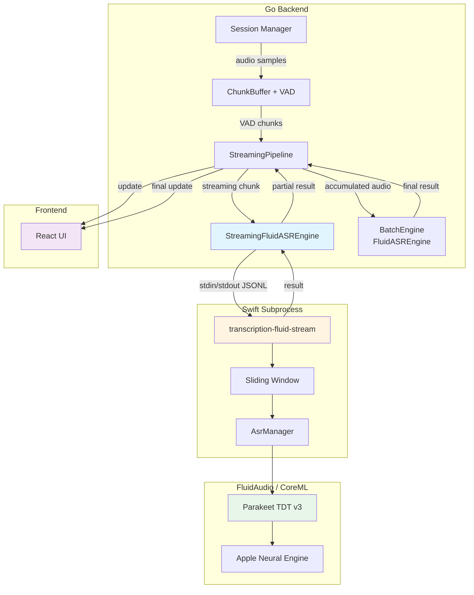
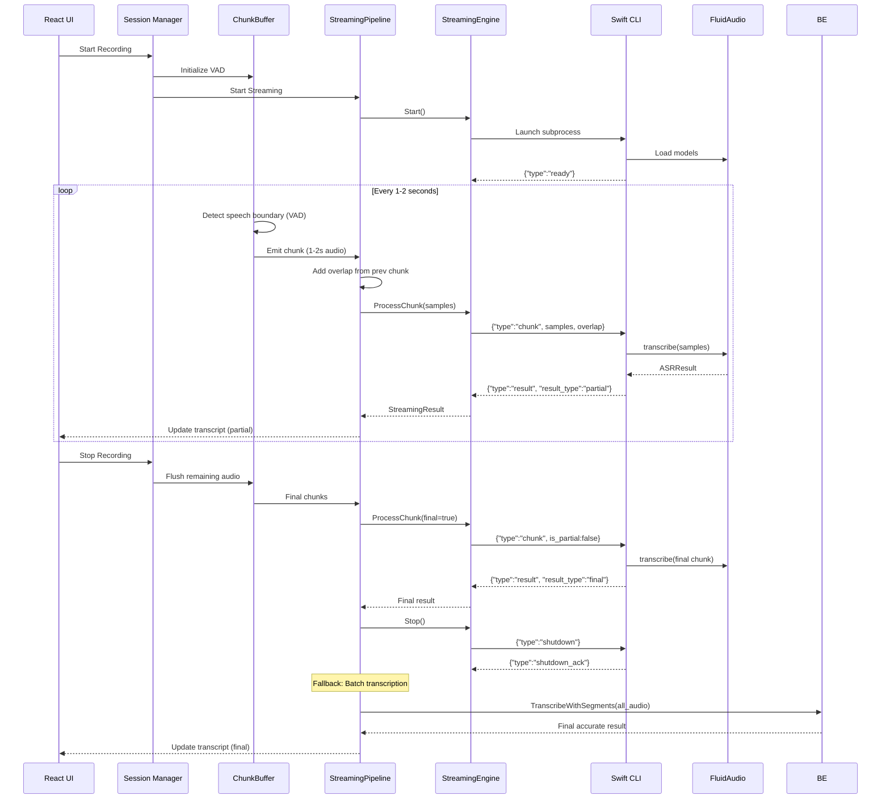
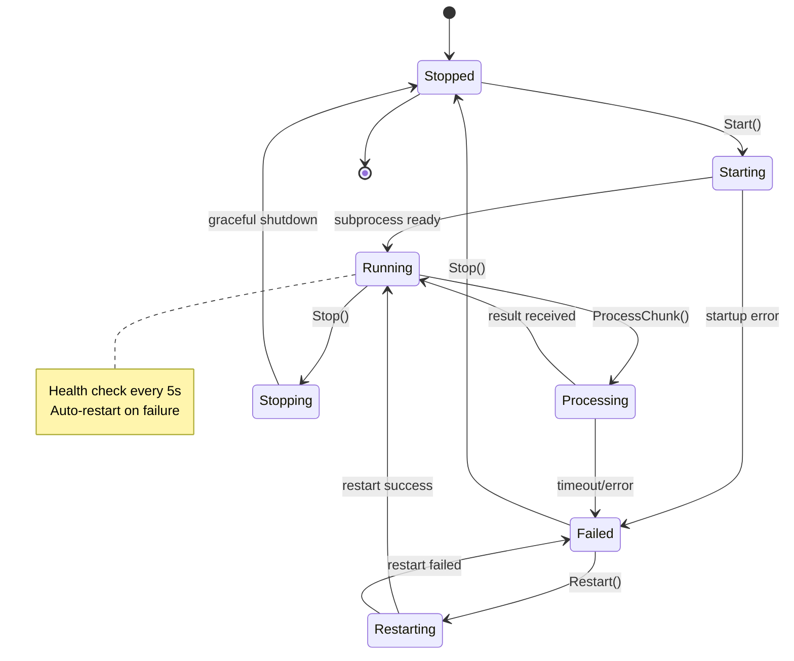

# Архитектура: Streaming Real-Time Транскрипция с Parakeet TDT v3

**Дата:** 2025-12-11  
**Статус:** Design / Proposal  
**Архитектор:** @architect  
**На основе анализа:** Текущая batch-реализация FluidASREngine

---

## Содержание

1. [Executive Summary](#executive-summary)
2. [Текущее состояние (AS-IS)](#текущее-состояние-as-is)
3. [Целевая архитектура (TO-BE)](#целевая-архитектура-to-be)
4. [ADR: Архитектурные решения](#adr-архитектурные-решения)
5. [Компоненты системы](#компоненты-системы)
6. [Протокол взаимодействия](#протокол-взаимодействия)
7. [Диаграммы](#диаграммы)
8. [Псевдокод ключевых методов](#псевдокод-ключевых-методов)
9. [Нефункциональные требования](#нефункциональные-требования)
10. [Риски и митигации](#риски-и-митигации)
11. [План реализации](#план-реализации)

---

## Executive Summary

### Проблема
Текущая реализация FluidASREngine работает в **batch-режиме**: принимает весь аудио массив целиком, возвращает готовые сегменты после полной обработки. Это создаёт задержку в UX — пользователь не видит промежуточных результатов во время записи.

### Решение
Спроектировать **StreamingFluidASREngine** для real-time транскрипции с поддержкой:
- Обработки аудио чанками (1-2 секунды)
- Partial results (промежуточные гипотезы)
- Низкой латентности (< 500ms от получения аудио до результата)
- Graceful fallback на batch-режим

### Ключевые решения
1. **Long-running subprocess** вместо multiple invocations для снижения overhead
2. **Line-delimited JSON** протокол для streaming коммуникации
3. **Sliding window context** для улучшения точности на границах чанков
4. **VAD-based chunking** для определения естественных границ речи
5. **Hybrid approach**: streaming для UI, batch для финальной транскрипции

### Ограничения
- FluidAudio API **не поддерживает streaming напрямую** (только batch `transcribe()`)
- Apple Neural Engine оптимизирован для batch inference
- Subprocess overhead при частых запусках

---

## Текущее состояние (AS-IS)

### Архитектура

```
┌─────────────────────────────────────────────────────────────┐
│                      Go Backend                             │
│  ┌──────────────────────────────────────────────────────┐   │
│  │ FluidASREngine                                       │   │
│  │  - TranscribeWithSegments(samples []float32)         │   │
│  │  - Запускает subprocess для каждого вызова           │   │
│  └──────────────────────────────────────────────────────┘   │
│                          ↓                                   │
│                    exec.Command()                            │
│                          ↓                                   │
│  ┌──────────────────────────────────────────────────────┐   │
│  │ transcription-fluid (Swift CLI)                      │   │
│  │  - Читает все samples из stdin                       │   │
│  │  - AsrManager.transcribe(samples) - BATCH            │   │
│  │  - Возвращает JSON с сегментами                      │   │
│  └──────────────────────────────────────────────────────┘   │
│                          ↓                                   │
│  ┌──────────────────────────────────────────────────────┐   │
│  │ FluidAudio / Parakeet TDT v3                         │   │
│  │  - Batch inference на Apple Neural Engine            │   │
│  │  - Возвращает ASRResult с полным текстом             │   │
│  └──────────────────────────────────────────────────────┘   │
└─────────────────────────────────────────────────────────────┘
```

### Проблемы
1. **Высокая латентность**: Нужно накопить весь аудио чанк перед обработкой
2. **Нет partial results**: Пользователь не видит промежуточных результатов
3. **Subprocess overhead**: Каждый вызов = новый процесс (хотя это изолирует memory leaks)
4. **Нет контекста**: Каждый чанк обрабатывается независимо, теряется контекст на границах

### Метрики
- **RTF**: ~110x на M4 Pro (1 минута аудио ≈ 0.5s)
- **Latency**: 0.5s + время накопления чанка (1-5 секунд)
- **Memory**: Изолирован в subprocess, нет leaks

---

## Целевая архитектура (TO-BE)

### Концепция

**Hybrid Streaming Architecture**: Комбинация streaming для UI feedback и batch для финальной точности.

```
┌─────────────────────────────────────────────────────────────────────┐
│                         Go Backend                                  │
│  ┌──────────────────────────────────────────────────────────────┐   │
│  │ StreamingFluidASREngine                                      │   │
│  │  - Start() - запускает long-running subprocess               │   │
│  │  - ProcessChunk(samples) - отправляет чанк, получает result │   │
│  │  - Stop() - graceful shutdown                                │   │
│  └──────────────────────────────────────────────────────────────┘   │
│                          ↓ stdin/stdout                              │
│  ┌──────────────────────────────────────────────────────────────┐   │
│  │ transcription-fluid-stream (Swift CLI)                       │   │
│  │  - Long-running process                                      │   │
│  │  - Читает чанки из stdin (line-delimited JSON)              │   │
│  │  - Поддерживает sliding window context                      │   │
│  │  - Возвращает partial + final results                       │   │
│  └──────────────────────────────────────────────────────────────┘   │
│                          ↓                                           │
│  ┌──────────────────────────────────────────────────────────────┐   │
│  │ FluidAudio / Parakeet TDT v3                                 │   │
│  │  - Batch inference на каждый чанк (нет streaming API)        │   │
│  │  - Используем sliding window для контекста                  │   │
│  └──────────────────────────────────────────────────────────────┘   │
└─────────────────────────────────────────────────────────────────────┘

┌─────────────────────────────────────────────────────────────────────┐
│                      Session Manager                                │
│  ┌──────────────────────────────────────────────────────────────┐   │
│  │ ChunkBuffer (VAD-based)                                      │   │
│  │  - Накапливает аудио                                         │   │
│  │  - Определяет границы речи (VAD)                             │   │
│  │  - Эмитит чанки по паузам (1-2 сек речи)                    │   │
│  └──────────────────────────────────────────────────────────────┘   │
│                          ↓                                           │
│  ┌──────────────────────────────────────────────────────────────┐   │
│  │ Streaming Pipeline                                           │   │
│  │  1. Получить чанк от ChunkBuffer                            │   │
│  │  2. Отправить в StreamingFluidASREngine                     │   │
│  │  3. Получить partial result → UI update                     │   │
│  │  4. Накопить для финальной batch транскрипции               │   │
│  └──────────────────────────────────────────────────────────────┘   │
└─────────────────────────────────────────────────────────────────────┘
```

### Ключевые отличия

| Аспект | AS-IS (Batch) | TO-BE (Streaming) |
|--------|---------------|-------------------|
| **Subprocess** | Multiple invocations | Long-running process |
| **Протокол** | Binary stdin → JSON stdout | Line-delimited JSON bidirectional |
| **Латентность** | 0.5s + накопление (1-5s) | 0.3-0.5s от получения чанка |
| **Partial results** | Нет | Да (промежуточные гипотезы) |
| **Контекст** | Нет | Sliding window (0.5-1s overlap) |
| **VAD** | Опционально | Обязательно для chunking |
| **Fallback** | N/A | Batch для финальной транскрипции |

---

## ADR: Архитектурные решения

### ADR-1: Long-running subprocess vs Multiple invocations

**Решение:** Long-running subprocess

**Альтернативы:**
1. Multiple invocations (текущий подход)
2. In-process Swift library (через CGO)
3. gRPC service

**Обоснование:**
- **Pros:**
  - Снижение overhead запуска процесса (загрузка моделей 1 раз)
  - Возможность поддерживать контекст между чанками
  - Bidirectional streaming через stdin/stdout
- **Cons:**
  - Сложнее управление жизненным циклом
  - Нужен graceful shutdown
  - Потенциальные memory leaks (но subprocess изолирован)

**Последствия:**
- Нужен механизм health check subprocess
- Restart при сбоях
- Timeout для операций

---

### ADR-2: Протокол коммуникации

**Решение:** Line-delimited JSON (JSONL)

**Альтернативы:**
1. Binary protocol (protobuf)
2. MessagePack
3. Custom binary format

**Обоснование:**
- **Pros:**
  - Простота отладки (human-readable)
  - Нативная поддержка в Go/Swift (json.Encoder/Decoder)
  - Streaming-friendly (line-by-line parsing)
  - Extensible (легко добавлять поля)
- **Cons:**
  - Больше размер по сравнению с binary
  - Парсинг медленнее protobuf

**Последствия:**
- Аудио передаётся как base64 в JSON (overhead ~33%)
- Альтернатива: отдельный binary stream для аудио

---

### ADR-3: Chunking strategy

**Решение:** VAD-based chunking с фиксированным fallback

**Альтернативы:**
1. Fixed-size chunks (1s, 2s)
2. Silence detection только
3. Sentence boundary detection

**Обоснование:**
- **Pros:**
  - Естественные границы речи → лучшая точность
  - Адаптивный размер чанков
  - Совместимость с существующим ChunkBuffer
- **Cons:**
  - Зависимость от качества VAD
  - Переменная латентность

**Последствия:**
- Используем Silero VAD (уже интегрирован)
- Fallback на fixed 2s chunks при отсутствии VAD

---

### ADR-4: Context management

**Решение:** Sliding window с overlap 0.5-1s

**Альтернативы:**
1. No context (независимые чанки)
2. Full history (весь предыдущий текст)
3. Attention-based context (требует модификации модели)

**Обоснование:**
- **Pros:**
  - Улучшает точность на границах чанков
  - Ограниченный memory footprint
  - Не требует изменений модели
- **Cons:**
  - Дублирование обработки overlap области
  - Нужна логика merge результатов

**Последствия:**
- Overlap 0.5s = 8000 samples (16kHz)
- Merge strategy: приоритет новому результату

---

### ADR-5: Partial results strategy

**Решение:** Immediate partial + delayed final

**Альтернативы:**
1. Only final results
2. Progressive refinement (multiple partials)
3. Confidence-based filtering

**Обоснование:**
- **Pros:**
  - Быстрый feedback для UI
  - Финальный результат более точный
  - Гибкость для разных use cases
- **Cons:**
  - Сложнее UI логика (partial → final transition)
  - Потенциальные "прыжки" текста

**Последствия:**
- Partial: низкая confidence, может меняться
- Final: высокая confidence, стабильный
- UI должен различать типы результатов

---

### ADR-6: Fallback strategy

**Решение:** Hybrid approach - streaming для UI, batch для финальной транскрипции

**Альтернативы:**
1. Streaming only
2. Batch only (текущий)
3. Streaming с post-processing

**Обоснование:**
- **Pros:**
  - Лучший UX (streaming feedback)
  - Максимальная точность (batch для финала)
  - Graceful degradation при проблемах streaming
- **Cons:**
  - Двойная обработка аудио
  - Больше ресурсов

**Последствия:**
- Streaming результаты - "preview"
- Batch результаты - "final" (после остановки записи)
- Опция отключить batch для экономии ресурсов

---

## Компоненты системы

### 1. StreamingFluidASREngine (Go)

**Ответственность:**
- Управление жизненным циклом subprocess
- Отправка аудио чанков
- Получение и парсинг результатов
- Health check и restart

**Интерфейс:**
```go
type StreamingFluidASREngine interface {
    // Запуск long-running subprocess
    Start(ctx context.Context) error
    
    // Обработка чанка аудио
    ProcessChunk(samples []float32, options ChunkOptions) (*StreamingResult, error)
    
    // Graceful shutdown
    Stop() error
    
    // Health check
    IsHealthy() bool
    
    // Restart при сбоях
    Restart(ctx context.Context) error
}

type ChunkOptions struct {
    IsPartial      bool    // Промежуточный чанк или финальный
    OverlapSamples int     // Количество overlap samples
    ChunkID        string  // Уникальный ID чанка
}

type StreamingResult struct {
    ChunkID    string              // ID чанка
    Type       ResultType          // Partial или Final
    Text       string              // Транскрипция
    Segments   []TranscriptSegment // Сегменты с timestamps
    Confidence float64             // Уверенность модели
    Latency    time.Duration       // Время обработки
}

type ResultType int
const (
    ResultTypePartial ResultType = iota
    ResultTypeFinal
)
```

**Состояния:**
```
┌─────────┐  Start()   ┌─────────┐  ProcessChunk()  ┌───────────┐
│ Stopped │ ────────> │ Running │ ──────────────> │ Processing│
└─────────┘            └─────────┘                  └───────────┘
     ↑                      │                             │
     │                      │ Error                       │
     │                      ↓                             │
     │                 ┌─────────┐                        │
     └──────────────── │ Failed  │ <──────────────────────┘
          Stop()       └─────────┘
```

---

### 2. transcription-fluid-stream (Swift CLI)

**Ответственность:**
- Long-running process
- Чтение чанков из stdin
- Управление sliding window context
- Вызов FluidAudio API
- Отправка результатов в stdout

**Протокол:**

**Input (stdin, line-delimited JSON):**
```json
{
  "type": "chunk",
  "chunk_id": "chunk_001",
  "samples": [0.1, 0.2, ...],  // или base64
  "sample_rate": 16000,
  "is_partial": true,
  "overlap_samples": 8000
}
```

**Output (stdout, line-delimited JSON):**
```json
{
  "type": "result",
  "chunk_id": "chunk_001",
  "result_type": "partial",
  "text": "Hello world",
  "segments": [
    {"start": 0.0, "end": 1.5, "text": "Hello world"}
  ],
  "confidence": 0.92,
  "latency_ms": 450
}
```

**Control messages:**
```json
// Health check
{"type": "ping"}
// Response
{"type": "pong", "status": "ok"}

// Shutdown
{"type": "shutdown"}
// Response
{"type": "shutdown_ack"}
```

---

### 3. StreamingPipeline (Go)

**Ответственность:**
- Оркестрация streaming процесса
- Интеграция с ChunkBuffer (VAD)
- Управление контекстом между чанками
- Fallback на batch

**Workflow:**
```
1. ChunkBuffer эмитит чанк (VAD-based)
2. StreamingPipeline добавляет overlap из предыдущего чанка
3. Отправляет в StreamingFluidASREngine
4. Получает partial result → отправляет в UI
5. Накапливает аудио для финальной batch транскрипции
6. При остановке записи → batch транскрипция всего аудио
```

---

### 4. ChunkBuffer (существующий, модификации)

**Модификации:**
- Добавить режим "streaming" с меньшими чанками (1-2s)
- Поддержка overlap для контекста
- Опция "immediate emit" для low-latency

**Конфигурация:**
```go
type VADConfig struct {
    // Существующие поля
    VADMode             VADMode
    SilenceDuration     time.Duration
    MinChunkDuration    time.Duration
    MaxChunkDuration    time.Duration
    
    // Новые для streaming
    StreamingMode       bool          // Включить streaming режим
    StreamingChunkSize  time.Duration // 1-2s для streaming
    OverlapDuration     time.Duration // 0.5-1s overlap
    ImmediateEmit       bool          // Эмитить сразу без ожидания паузы
}
```

---

## Протокол взаимодействия

### Формат сообщений

#### Request (Go → Swift)

```json
{
  "type": "chunk",
  "chunk_id": "session_abc_chunk_042",
  "samples": "base64_encoded_float32_array",
  "sample_rate": 16000,
  "is_partial": true,
  "overlap_samples": 8000,
  "options": {
    "pause_threshold": 0.5,
    "language": "multi"
  }
}
```

**Поля:**
- `type`: "chunk" | "ping" | "shutdown"
- `chunk_id`: Уникальный идентификатор чанка
- `samples`: Base64-encoded float32 array (или JSON array для отладки)
- `sample_rate`: Частота дискретизации (обычно 16000)
- `is_partial`: true = промежуточный чанк, false = финальный
- `overlap_samples`: Количество samples из предыдущего чанка для контекста
- `options`: Дополнительные параметры транскрипции

#### Response (Swift → Go)

```json
{
  "type": "result",
  "chunk_id": "session_abc_chunk_042",
  "result_type": "partial",
  "text": "Hello world",
  "segments": [
    {
      "start": 0.0,
      "end": 1.5,
      "text": "Hello world",
      "confidence": 0.95
    }
  ],
  "confidence": 0.92,
  "latency_ms": 450,
  "rtfx": 110.5,
  "error": null
}
```

**Поля:**
- `type`: "result" | "pong" | "shutdown_ack" | "error"
- `chunk_id`: ID обработанного чанка
- `result_type`: "partial" | "final"
- `text`: Полный текст транскрипции
- `segments`: Массив сегментов с timestamps
- `confidence`: Общая уверенность модели (0.0-1.0)
- `latency_ms`: Время обработки в миллисекундах
- `rtfx`: Real-time factor (скорость обработки)
- `error`: Сообщение об ошибке (если есть)

#### Error Response

```json
{
  "type": "error",
  "chunk_id": "session_abc_chunk_042",
  "error": "Failed to transcribe: model not loaded",
  "error_code": "MODEL_NOT_LOADED"
}
```

---

### Последовательность взаимодействия

#### Инициализация

```
Go                          Swift CLI
│                              │
├─ Start subprocess ──────────>│
│                              ├─ Load models
│                              ├─ Initialize AsrManager
│                              │
│<─────── Ready message ───────┤
│  {"type":"ready","status":"ok"}
│                              │
```

#### Обработка чанка

```
Go                          Swift CLI
│                              │
├─ Send chunk ───────────────>│
│  {"type":"chunk",...}        │
│                              ├─ Add to sliding window
│                              ├─ Call AsrManager.transcribe()
│                              ├─ Parse result
│                              │
│<─── Partial result ──────────┤
│  {"type":"result","result_type":"partial",...}
│                              │
│  [UI update]                 │
│                              │
├─ Send next chunk ──────────>│
│                              ├─ Merge with overlap
│                              ├─ Transcribe
│                              │
│<─── Final result ────────────┤
│  {"type":"result","result_type":"final",...}
│                              │
```

#### Health Check

```
Go                          Swift CLI
│                              │
├─ Ping ─────────────────────>│
│  {"type":"ping"}             │
│                              │
│<─── Pong ────────────────────┤
│  {"type":"pong","status":"ok"}
│                              │
```

#### Shutdown

```
Go                          Swift CLI
│                              │
├─ Shutdown ─────────────────>│
│  {"type":"shutdown"}         │
│                              ├─ Flush buffers
│                              ├─ Release models
│                              │
│<─── Ack ─────────────────────┤
│  {"type":"shutdown_ack"}     │
│                              │
├─ Wait for exit              │
│                              ├─ Exit(0)
│                              │
```

---

## Диаграммы

### Архитектура компонентов



### Sequence Diagram: Streaming Transcription



### State Machine: StreamingFluidASREngine



### Data Flow: Sliding Window Context

```mermaid
graph LR
    subgraph "Chunk 1"
        C1[Samples 0-16000<br/>0-1s]
    end
    
    subgraph "Chunk 2"
        O1[Overlap 8000-16000<br/>0.5-1s]
        C2[New 16000-32000<br/>1-2s]
    end
    
    subgraph "Chunk 3"
        O2[Overlap 24000-32000<br/>1.5-2s]
        C3[New 32000-48000<br/>2-3s]
    end
    
    C1 -->|transcribe| R1[Result 1:<br/>"Hello"]
    O1 --> C2
    C2 -->|transcribe| R2[Result 2:<br/>"Hello world"]
    O2 --> C3
    C3 -->|transcribe| R3[Result 3:<br/>"world how"]
    
    R1 --> M1[Merge]
    R2 --> M1
    R3 --> M1
    M1 --> F[Final:<br/>"Hello world how"]
    
    style O1 fill:#ffe0b2
    style O2 fill:#ffe0b2
    style M1 fill:#c8e6c9
```

---

## Псевдокод ключевых методов

### StreamingFluidASREngine.Start()

```go
func (e *StreamingFluidASREngine) Start(ctx context.Context) error {
    e.mu.Lock()
    defer e.mu.Unlock()
    
    if e.state != StateStopped {
        return fmt.Errorf("engine already running")
    }
    
    // Запускаем subprocess
    args := []string{
        "--stream",
        "--model-cache-dir", e.modelCacheDir,
        "--pause-threshold", fmt.Sprintf("%.3f", e.pauseThreshold),
    }
    
    e.cmd = exec.CommandContext(ctx, e.binaryPath, args...)
    
    // Настраиваем pipes
    stdin, _ := e.cmd.StdinPipe()
    stdout, _ := e.cmd.StdoutPipe()
    stderr, _ := e.cmd.StderrPipe()
    
    e.stdin = stdin
    e.stdout = stdout
    e.stderr = stderr
    
    // Запускаем процесс
    if err := e.cmd.Start(); err != nil {
        return fmt.Errorf("failed to start subprocess: %w", err)
    }
    
    e.state = StateStarting
    
    // Ждём ready message
    decoder := json.NewDecoder(stdout)
    var msg Message
    
    select {
    case <-time.After(30 * time.Second):
        e.cmd.Process.Kill()
        return fmt.Errorf("subprocess startup timeout")
    case <-ctx.Done():
        e.cmd.Process.Kill()
        return ctx.Err()
    default:
        if err := decoder.Decode(&msg); err != nil {
            return fmt.Errorf("failed to read ready message: %w", err)
        }
        
        if msg.Type != "ready" {
            return fmt.Errorf("unexpected message: %s", msg.Type)
        }
    }
    
    e.state = StateRunning
    e.encoder = json.NewEncoder(stdin)
    e.decoder = decoder
    
    // Запускаем health check goroutine
    go e.healthCheckLoop(ctx)
    
    log.Printf("StreamingFluidASREngine started")
    return nil
}
```

---

### StreamingFluidASREngine.ProcessChunk()

```go
func (e *StreamingFluidASREngine) ProcessChunk(
    samples []float32,
    options ChunkOptions,
) (*StreamingResult, error) {
    e.mu.Lock()
    defer e.mu.Unlock()
    
    if e.state != StateRunning {
        return nil, fmt.Errorf("engine not running")
    }
    
    e.state = StateProcessing
    defer func() { e.state = StateRunning }()
    
    // Подготавливаем request
    req := ChunkRequest{
        Type:           "chunk",
        ChunkID:        options.ChunkID,
        Samples:        encodeSamples(samples), // base64
        SampleRate:     16000,
        IsPartial:      options.IsPartial,
        OverlapSamples: options.OverlapSamples,
    }
    
    // Отправляем в subprocess
    startTime := time.Now()
    if err := e.encoder.Encode(req); err != nil {
        return nil, fmt.Errorf("failed to send chunk: %w", err)
    }
    
    // Читаем response с timeout
    responseChan := make(chan ChunkResponse, 1)
    errChan := make(chan error, 1)
    
    go func() {
        var resp ChunkResponse
        if err := e.decoder.Decode(&resp); err != nil {
            errChan <- err
            return
        }
        responseChan <- resp
    }()
    
    select {
    case resp := <-responseChan:
        if resp.Type == "error" {
            return nil, fmt.Errorf("transcription error: %s", resp.Error)
        }
        
        latency := time.Since(startTime)
        
        return &StreamingResult{
            ChunkID:    resp.ChunkID,
            Type:       parseResultType(resp.ResultType),
            Text:       resp.Text,
            Segments:   resp.Segments,
            Confidence: resp.Confidence,
            Latency:    latency,
        }, nil
        
    case err := <-errChan:
        return nil, fmt.Errorf("failed to read response: %w", err)
        
    case <-time.After(10 * time.Second):
        return nil, fmt.Errorf("chunk processing timeout")
    }
}
```

---

### StreamingPipeline.ProcessStream()

```go
func (p *StreamingPipeline) ProcessStream(ctx context.Context) error {
    // Инициализация
    if err := p.engine.Start(ctx); err != nil {
        return fmt.Errorf("failed to start engine: %w", err)
    }
    defer p.engine.Stop()
    
    var prevChunkSamples []float32
    overlapSize := int(p.config.OverlapDuration.Seconds() * 16000)
    
    // Обработка чанков из ChunkBuffer
    for {
        select {
        case <-ctx.Done():
            return ctx.Err()
            
        case chunk := <-p.chunkBuffer.Output():
            // Добавляем overlap из предыдущего чанка
            samples := chunk.Samples
            if len(prevChunkSamples) > 0 {
                overlapStart := len(prevChunkSamples) - overlapSize
                if overlapStart < 0 {
                    overlapStart = 0
                }
                overlap := prevChunkSamples[overlapStart:]
                samples = append(overlap, samples...)
            }
            
            // Отправляем в streaming engine
            result, err := p.engine.ProcessChunk(samples, ChunkOptions{
                ChunkID:        chunk.ID,
                IsPartial:      true,
                OverlapSamples: len(samples) - len(chunk.Samples),
            })
            
            if err != nil {
                log.Printf("Streaming transcription error: %v", err)
                // Fallback: накапливаем для batch
                p.accumulatedSamples = append(p.accumulatedSamples, chunk.Samples...)
                continue
            }
            
            // Отправляем partial result в UI
            p.onPartialResult(result)
            
            // Накапливаем для финальной batch транскрипции
            p.accumulatedSamples = append(p.accumulatedSamples, chunk.Samples...)
            
            // Сохраняем для следующего overlap
            prevChunkSamples = chunk.Samples
        }
    }
}
```

---

### Swift CLI: main.swift (streaming mode)

```swift
@main
struct TranscriptionStreamCLI {
    static func main() async {
        let args = CommandLine.arguments
        
        guard args.contains("--stream") else {
            // Fallback to batch mode
            await runBatchMode()
            return
        }
        
        // Streaming mode
        await runStreamingMode()
    }
    
    static func runStreamingMode() async {
        do {
            // Загружаем модели
            fputs("[stream] Loading models...\n", stderr)
            let models = try await AsrModels.downloadAndLoad(version: .v3)
            let asrManager = AsrManager(config: .default)
            try await asrManager.initialize(models: models)
            
            // Отправляем ready message
            sendMessage(ReadyMessage(type: "ready", status: "ok"))
            
            // Sliding window для контекста
            var slidingWindow: [Float] = []
            let maxWindowSize = 16000 * 2 // 2 секунды
            
            // Читаем чанки из stdin
            while let line = readLine() {
                guard let data = line.data(using: .utf8),
                      let request = try? JSONDecoder().decode(ChunkRequest.self, from: data) else {
                    sendError("Invalid request format")
                    continue
                }
                
                // Обработка control messages
                if request.type == "ping" {
                    sendMessage(PongMessage(type: "pong", status: "ok"))
                    continue
                }
                
                if request.type == "shutdown" {
                    sendMessage(ShutdownAckMessage(type: "shutdown_ack"))
                    break
                }
                
                // Декодируем samples
                guard let samples = decodeSamples(request.samples) else {
                    sendError("Failed to decode samples", chunkID: request.chunkID)
                    continue
                }
                
                // Добавляем в sliding window
                slidingWindow.append(contentsOf: samples)
                if slidingWindow.count > maxWindowSize {
                    slidingWindow.removeFirst(slidingWindow.count - maxWindowSize)
                }
                
                // Транскрибируем
                let startTime = Date()
                let result = try await asrManager.transcribe(slidingWindow)
                let latency = Date().timeIntervalSince(startTime)
                
                // Формируем response
                let segments = createSegments(from: result, overlapSamples: request.overlapSamples)
                
                let response = ChunkResponse(
                    type: "result",
                    chunkID: request.chunkID,
                    resultType: request.isPartial ? "partial" : "final",
                    text: result.text,
                    segments: segments,
                    confidence: result.confidence,
                    latencyMs: Int(latency * 1000),
                    rtfx: result.rtfx,
                    error: nil
                )
                
                sendMessage(response)
                
                // Очищаем старые данные из window при финальном чанке
                if !request.isPartial {
                    slidingWindow.removeAll()
                }
            }
            
        } catch {
            sendError("Streaming error: \(error.localizedDescription)")
        }
    }
    
    static func sendMessage<T: Encodable>(_ message: T) {
        if let data = try? JSONEncoder().encode(message),
           let json = String(data: data, encoding: .utf8) {
            print(json)
            fflush(stdout)
        }
    }
    
    static func sendError(_ message: String, chunkID: String? = nil) {
        let error = ErrorMessage(
            type: "error",
            chunkID: chunkID,
            error: message,
            errorCode: "TRANSCRIPTION_ERROR"
        )
        sendMessage(error)
    }
}
```

---

## Нефункциональные требования

### Производительность

| Метрика | Целевое значение | Измерение |
|---------|------------------|-----------|
| **Latency (chunk → result)** | < 500ms (p95) | От получения чанка до partial result |
| **RTF (Real-Time Factor)** | > 100x | Скорость обработки vs реальное время |
| **Throughput** | > 10 chunks/sec | Количество обрабатываемых чанков в секунду |
| **Startup time** | < 5s | Время загрузки моделей и инициализации |
| **Memory (subprocess)** | < 1GB | Пиковое потребление памяти Swift CLI |
| **CPU (ANE offload)** | < 10% | CPU usage при активной транскрипции |

### Надёжность

| Требование | Целевое значение | Митигация |
|------------|------------------|-----------|
| **Uptime** | 99.9% | Auto-restart при сбоях |
| **Error rate** | < 0.1% | Graceful fallback на batch |
| **Recovery time** | < 2s | Быстрый restart subprocess |
| **Data loss** | 0% | Накопление аудио для batch fallback |

### Масштабируемость

| Аспект | Ограничение | Обоснование |
|--------|-------------|-------------|
| **Concurrent sessions** | 1 per device | ANE ресурс ограничен |
| **Max audio duration** | Unlimited | Streaming обрабатывает любую длину |
| **Chunk size** | 1-5s | Баланс между латентностью и точностью |
| **Sliding window** | 2s max | Ограничение памяти и latency |

### Безопасность

| Требование | Реализация |
|------------|------------|
| **Process isolation** | Subprocess sandbox |
| **Data privacy** | Все локально, нет сети |
| **Input validation** | Проверка размера чанков, sample rate |
| **Resource limits** | Timeout для операций, memory limits |

---

## Риски и митигации

### Риск 1: FluidAudio не поддерживает streaming API

**Вероятность:** High  
**Влияние:** High  
**Описание:** FluidAudio предоставляет только batch API `transcribe(samples)`, нет нативного streaming.

**Митигация:**
1. **Workaround:** Использовать batch API на каждый чанк с sliding window
2. **Optimization:** Минимизировать размер чанков (1-2s) для снижения latency
3. **Fallback:** Hybrid approach - streaming для UI, batch для финала
4. **Future:** Запросить streaming API у FluidAudio team

**Статус:** Accepted (workaround реализуем)

---

### Риск 2: Subprocess overhead снижает производительность

**Вероятность:** Medium  
**Влияние:** Medium  
**Описание:** Long-running subprocess может накапливать memory leaks или деградировать.

**Митигация:**
1. **Health check:** Периодический ping/pong для проверки состояния
2. **Auto-restart:** Restart subprocess при обнаружении проблем
3. **Memory monitoring:** Отслеживание memory usage subprocess
4. **Timeout:** Принудительный restart каждые N минут (опционально)

**Статус:** Mitigated (health check + restart)

---

### Риск 3: Sliding window увеличивает latency

**Вероятность:** Medium  
**Влияние:** Low  
**Описание:** Overlap 0.5-1s добавляет дополнительные samples для обработки.

**Митигация:**
1. **Optimization:** Использовать минимальный overlap (0.5s)
2. **Adaptive:** Увеличивать overlap только при низкой confidence
3. **Caching:** Кэшировать результаты overlap области
4. **Measurement:** Профилировать и оптимизировать

**Статус:** Accepted (overhead приемлем)

---

### Риск 4: VAD ошибки приводят к плохому chunking

**Вероятность:** Medium  
**Влияние:** Medium  
**Описание:** Silero VAD может ошибаться, создавая неоптимальные границы чанков.

**Митигация:**
1. **Fallback:** Fixed-size chunks (2s) при отсутствии VAD
2. **Tuning:** Настройка threshold VAD для разных условий
3. **Hybrid:** Комбинация VAD + fixed max size
4. **Monitoring:** Метрики качества chunking

**Статус:** Mitigated (fallback + tuning)

---

### Риск 5: Partial results "прыгают" в UI

**Вероятность:** High  
**Влияние:** Low  
**Описание:** Промежуточные результаты могут меняться, создавая визуальный шум.

**Митигация:**
1. **UI Design:** Визуальное различие partial vs final (цвет, opacity)
2. **Debouncing:** Задержка обновления UI для стабилизации
3. **Confidence threshold:** Показывать только high-confidence partials
4. **Animation:** Smooth transitions между partial и final

**Статус:** Accepted (UI решение)

---

### Риск 6: Batch fallback удваивает обработку

**Вероятность:** High  
**Влияние:** Low  
**Описание:** Hybrid approach обрабатывает аудио дважды (streaming + batch).

**Митигация:**
1. **Optional:** Сделать batch fallback опциональным
2. **Optimization:** Batch только при низкой confidence streaming
3. **Caching:** Переиспользовать streaming результаты где возможно
4. **User choice:** Настройка в UI (speed vs accuracy)

**Статус:** Accepted (trade-off для качества)

---

## План реализации

### Фаза 1: Proof of Concept (1-2 дня)

**Цель:** Проверить feasibility streaming подхода

**Задачи:**
1. ✅ Изучить FluidAudio API (batch only)
2. ✅ Создать простой Swift CLI с stdin/stdout
3. ✅ Протестировать latency batch API на малых чанках
4. ✅ Измерить overhead subprocess startup
5. ✅ Оценить sliding window approach

**Критерии успеха:**
- Latency < 1s на чанк 2s
- Subprocess startup < 5s
- Sliding window работает корректно

---

### Фаза 2: Core Implementation (3-5 дней)

**Цель:** Реализовать базовый streaming engine

**Задачи:**

**Go Backend:**
1. Создать `StreamingFluidASREngine` с интерфейсом
2. Реализовать lifecycle management (Start/Stop/Restart)
3. Добавить JSONL протокол (encoder/decoder)
4. Реализовать health check mechanism
5. Добавить error handling и timeouts

**Swift CLI:**
1. Создать `transcription-fluid-stream` binary
2. Реализовать JSONL stdin/stdout protocol
3. Добавить sliding window logic
4. Реализовать control messages (ping/shutdown)
5. Добавить error reporting

**Тесты:**
1. Unit tests для StreamingFluidASREngine
2. Integration tests для протокола
3. End-to-end test с реальным аудио

**Критерии успеха:**
- Все тесты проходят
- Latency < 500ms (p95)
- Graceful shutdown работает
- Health check детектирует сбои

---

### Фаза 3: Integration (2-3 дня)

**Цель:** Интегрировать с существующей системой

**Задачи:**

**Session Manager:**
1. Добавить `StreamingPipeline` компонент
2. Интегрировать с `ChunkBuffer` (VAD)
3. Реализовать overlap management
4. Добавить batch fallback logic

**ChunkBuffer:**
1. Добавить streaming mode конфигурацию
2. Реализовать immediate emit для low-latency
3. Добавить overlap support

**API:**
1. Добавить gRPC методы для streaming results
2. Реализовать partial/final result types
3. Добавить confidence scores

**Тесты:**
1. Integration tests с ChunkBuffer
2. End-to-end tests с Session Manager
3. Performance tests (latency, throughput)

**Критерии успеха:**
- Streaming работает end-to-end
- Partial results приходят в UI
- Batch fallback работает корректно
- Метрики соответствуют NFR

---

### Фаза 4: UI & UX (2-3 дня)

**Цель:** Реализовать UI для streaming результатов

**Задачи:**

**Frontend:**
1. Добавить поддержку partial results в UI
2. Реализовать визуальное различие partial/final
3. Добавить smooth transitions
4. Реализовать confidence indicators
5. Добавить настройки (streaming on/off)

**UX:**
1. Debouncing для стабилизации UI
2. Animation для transitions
3. Loading states для streaming
4. Error states и fallback UI

**Тесты:**
1. UI tests для partial results
2. UX testing с реальными пользователями
3. Performance testing (UI responsiveness)

**Критерии успеха:**
- UI обновляется плавно
- Partial/final различимы визуально
- Нет "прыжков" текста
- Пользователи довольны UX

---

### Фаза 5: Optimization & Polish (2-3 дня)

**Цель:** Оптимизировать производительность и надёжность

**Задачи:**

**Performance:**
1. Профилировать latency bottlenecks
2. Оптимизировать sliding window
3. Минимизировать memory allocations
4. Tune VAD parameters

**Reliability:**
1. Добавить comprehensive error handling
2. Реализовать retry logic
3. Добавить monitoring и metrics
4. Stress testing (long sessions)

**Documentation:**
1. API documentation
2. Architecture documentation (этот документ)
3. User guide для streaming
4. Troubleshooting guide

**Критерии успеха:**
- Latency < 500ms (p95) стабильно
- Error rate < 0.1%
- Uptime > 99.9%
- Документация полная

---

### Фаза 6: Testing & Release (1-2 дня)

**Цель:** Финальное тестирование и релиз

**Задачи:**

**Testing:**
1. Full regression testing
2. Performance benchmarks
3. Stress testing (edge cases)
4. User acceptance testing

**Release:**
1. Feature flag для streaming (опционально)
2. Rollout plan (gradual release)
3. Monitoring setup
4. Rollback plan

**Критерии успеха:**
- Все тесты проходят
- Метрики соответствуют NFR
- Пользователи довольны
- Нет критических багов

---

## Общий timeline

**Общая длительность:** 12-18 дней (2-3 недели)

**Распределение:**
- Фаза 1 (PoC): 1-2 дня
- Фаза 2 (Core): 3-5 дней
- Фаза 3 (Integration): 2-3 дня
- Фаза 4 (UI/UX): 2-3 дня
- Фаза 5 (Optimization): 2-3 дня
- Фаза 6 (Testing): 1-2 дня

**Риски timeline:**
- FluidAudio API limitations могут потребовать дополнительных workarounds
- Performance optimization может занять больше времени
- UI/UX iterations могут потребовать дополнительных циклов

---

## Рекомендации для реализации

### Для @planner

**Приоритеты:**
1. **High:** Фаза 1 (PoC) - критично для валидации подхода
2. **High:** Фаза 2 (Core) - основная функциональность
3. **Medium:** Фаза 3 (Integration) - интеграция с системой
4. **Medium:** Фаза 4 (UI/UX) - пользовательский опыт
5. **Low:** Фаза 5 (Optimization) - можно делать итеративно
6. **High:** Фаза 6 (Testing) - критично для качества

**Декомпозиция:**
- Разбить каждую фазу на отдельные задачи (issues)
- Использовать feature branches для каждой фазы
- Регулярные code reviews после каждой фазы
- Performance benchmarks после фаз 2, 3, 5

---

### Для @coder

**Conventions:**
- Использовать существующие паттерны (subprocess pattern из diarization-fluid)
- JSONL протокол для streaming (простота отладки)
- Graceful error handling (fallback на batch)
- Comprehensive logging (stderr для Swift CLI)

**Шаблоны:**
```go
// StreamingFluidASREngine template
type StreamingFluidASREngine struct {
    binaryPath string
    cmd        *exec.Cmd
    stdin      io.WriteCloser
    stdout     io.ReadCloser
    encoder    *json.Encoder
    decoder    *json.Decoder
    state      EngineState
    mu         sync.Mutex
}
```

**Тестирование:**
- Unit tests для каждого компонента
- Integration tests для протокола
- End-to-end tests с реальным аудио
- Performance benchmarks

---

### Для @tester

**Ключевые сценарии:**

1. **Happy path:**
   - Запись → streaming results → остановка → final result
   - Проверка latency < 500ms
   - Проверка accuracy (сравнение с batch)

2. **Edge cases:**
   - Очень короткие чанки (< 0.5s)
   - Очень длинные чанки (> 5s)
   - Тишина (no speech)
   - Шум (background noise)
   - Быстрая речь / медленная речь

3. **Error scenarios:**
   - Subprocess crash → auto-restart
   - Timeout → fallback на batch
   - Invalid audio → error handling
   - Memory leak → monitoring

4. **Performance:**
   - Latency benchmarks (p50, p95, p99)
   - Throughput tests (chunks/sec)
   - Memory usage (subprocess)
   - CPU usage (ANE offload)

**NFR для проверки:**
- Latency < 500ms (p95)
- RTF > 100x
- Error rate < 0.1%
- Uptime > 99.9%
- Memory < 1GB

---

## Заключение

Спроектирована архитектура **StreamingFluidASREngine** для real-time транскрипции с использованием NVIDIA Parakeet TDT v3 через FluidAudio.

**Ключевые решения:**
1. **Long-running subprocess** для снижения overhead
2. **Line-delimited JSON** протокол для простоты и отладки
3. **Sliding window context** для улучшения точности
4. **VAD-based chunking** для естественных границ речи
5. **Hybrid approach** - streaming для UI, batch для финала

**Архитектурные риски:**
- FluidAudio не поддерживает streaming API (workaround через batch на чанки)
- Subprocess overhead (митигация через health check + restart)
- Partial results "прыгают" (UI решение)

**Рекомендуемый следующий агент:** @planner

**Обоснование:** Необходимо декомпозировать план реализации на конкретные задачи, определить приоритеты и создать roadmap для разработки.

---

**Документация сохранена:** `docs/architecture_streaming_parakeet_2025-12-11.md`
