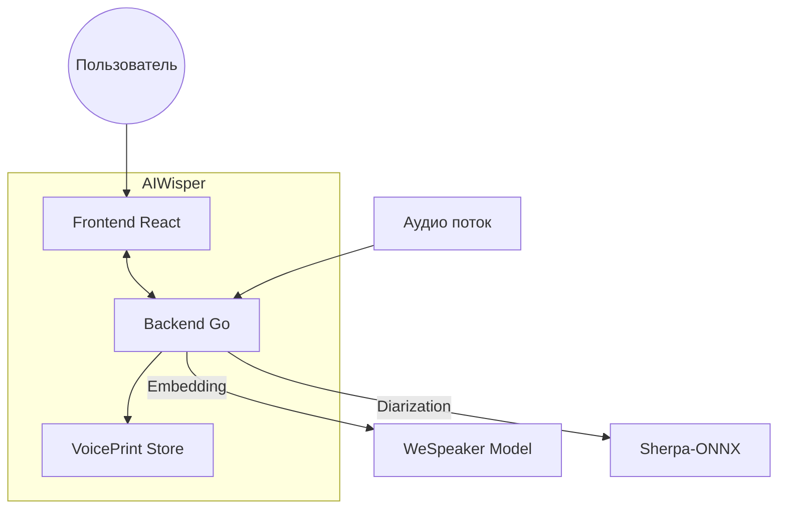
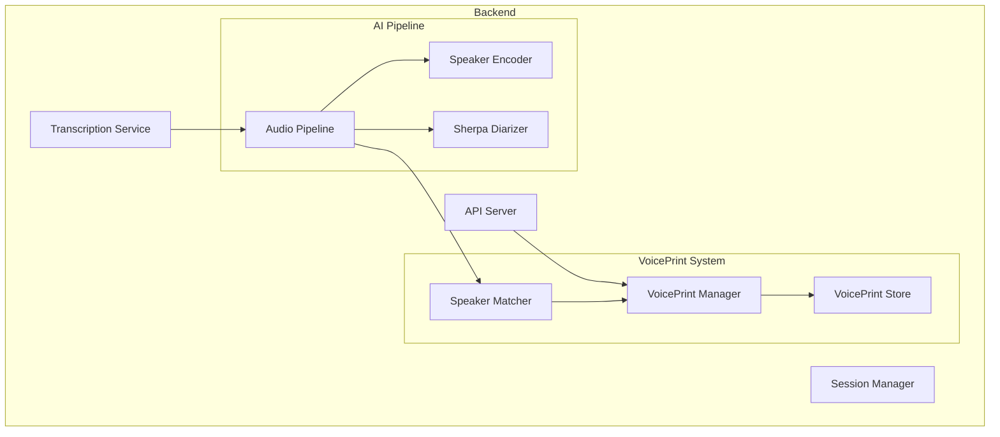
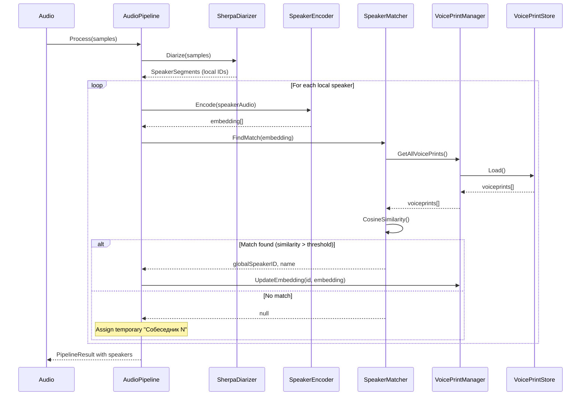
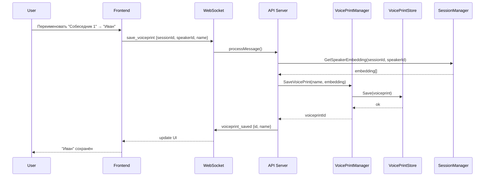

# Архитектура: Система глобальных спикеров (VoicePrints)

**Дата:** 2025-12-10 14:30
**Статус:** Draft
**Архитектор:** @architect
**Версия:** 1.0

---

## Резюме

Система VoicePrints позволяет сохранять голосовые отпечатки (embeddings) спикеров и автоматически распознавать их в новых сессиях. Это расширение существующей системы диаризации, которая сейчас работает только в рамках одной сессии.

---

## ADR (Architecture Decision Record)

### Ключевые решения

| Решение | Альтернативы | Обоснование | Последствия |
|---------|--------------|-------------|-------------|
| **JSON файл для хранения** | SQLite, BoltDB, BadgerDB | Простота, человекочитаемость, достаточно для ~100-1000 спикеров, легко бэкапить | Нужна блокировка при записи, нет индексов |
| **Усреднение embeddings** | Только первый, медиана, кластеризация | Улучшает качество при повторных встречах, простая реализация | Нужно хранить count для взвешенного усреднения |
| **Threshold 0.5 для matching** | Фиксированный 0.3-0.7, адаптивный | Баланс между false positives и false negatives, соответствует текущему clustering threshold | Может потребовать настройки пользователем |
| **Отдельный файл speakers.json** | В session.json, в config | Независимость от сессий, глобальность, простота миграции | Нужна синхронизация при параллельных записях |
| **WebSocket API** | REST API, gRPC | Уже используется для всех операций, real-time обновления | Нет проблем |

---

## Архитектурные диаграммы

### Context Diagram



### Component Diagram



### Sequence Diagram: Автоматическое распознавание спикера



### Sequence Diagram: Сохранение спикера пользователем



---

## Структуры данных

### Go (Backend)

```go
// backend/voiceprint/types.go
package voiceprint

import "time"

// VoicePrint представляет сохранённый голосовой отпечаток
type VoicePrint struct {
    ID         string    `json:"id"`         // UUID
    Name       string    `json:"name"`       // Имя спикера (например, "Иван")
    Embedding  []float32 `json:"embedding"`  // 256-мерный вектор (WeSpeaker ResNet34)
    CreatedAt  time.Time `json:"createdAt"`  // Время создания
    UpdatedAt  time.Time `json:"updatedAt"`  // Время последнего обновления
    LastSeenAt time.Time `json:"lastSeenAt"` // Время последнего распознавания
    SeenCount  int       `json:"seenCount"`  // Количество встреч (для усреднения)
    
    // Опционально: путь к аудио-сэмплу для воспроизведения
    SamplePath string `json:"samplePath,omitempty"`
    
    // Метаданные
    Source     string `json:"source,omitempty"` // "mic" или "sys" - откуда был записан
    Notes      string `json:"notes,omitempty"`  // Заметки пользователя
}

// VoicePrintStore хранилище голосовых отпечатков
type VoicePrintStore struct {
    Version    int          `json:"version"`    // Версия формата (для миграций)
    VoicePrints []VoicePrint `json:"voiceprints"`
}

// MatchResult результат поиска совпадения
type MatchResult struct {
    VoicePrint *VoicePrint
    Similarity float32 // Косинусное сходство (0-1)
    Confidence string  // "high", "medium", "low"
}

// SessionSpeaker спикер в контексте сессии (для UI)
type SessionSpeaker struct {
    LocalID      int       `json:"localId"`      // ID в рамках сессии (0, 1, 2...)
    GlobalID     string    `json:"globalId"`     // UUID из VoicePrint (если распознан)
    DisplayName  string    `json:"displayName"`  // "Вы", "Иван", "Собеседник 1"
    Embedding    []float32 `json:"embedding"`    // Текущий embedding
    IsRecognized bool      `json:"isRecognized"` // Был ли распознан из базы
    IsMic        bool      `json:"isMic"`        // Это микрофон (всегда "Вы")
    SegmentCount int       `json:"segmentCount"` // Количество сегментов речи
    TotalDuration float32  `json:"totalDuration"` // Общая длительность речи (сек)
}
```

### TypeScript (Frontend)

```typescript
// frontend/src/types/voiceprint.ts

export interface VoicePrint {
    id: string;
    name: string;
    embedding: number[];  // 256-мерный вектор
    createdAt: string;    // ISO date
    updatedAt: string;
    lastSeenAt: string;
    seenCount: number;
    samplePath?: string;
    source?: 'mic' | 'sys';
    notes?: string;
}

export interface SessionSpeaker {
    localId: number;
    globalId?: string;
    displayName: string;
    isRecognized: boolean;
    isMic: boolean;
    segmentCount: number;
    totalDuration: number;
    // Для UI: можно ли воспроизвести сэмпл
    hasSample: boolean;
}

export interface VoicePrintMatch {
    voiceprint: VoicePrint;
    similarity: number;
    confidence: 'high' | 'medium' | 'low';
}

// Состояние для контекста
export interface VoicePrintState {
    voiceprints: VoicePrint[];
    sessionSpeakers: SessionSpeaker[];
    isLoading: boolean;
    error: string | null;
}
```

---

## API Контракты

### WebSocket Messages

#### Получение списка VoicePrints

```typescript
// Request
{ type: "get_voiceprints" }

// Response
{
    type: "voiceprints_list",
    voiceprints: VoicePrint[]
}
```

#### Получение спикеров текущей сессии

```typescript
// Request
{ 
    type: "get_session_speakers",
    sessionId: string
}

// Response
{
    type: "session_speakers",
    sessionId: string,
    speakers: SessionSpeaker[]
}
```

#### Сохранение VoicePrint

```typescript
// Request
{
    type: "save_voiceprint",
    sessionId: string,
    localSpeakerId: number,  // ID спикера в сессии
    name: string,            // Имя для сохранения
    notes?: string
}

// Response (success)
{
    type: "voiceprint_saved",
    voiceprint: VoicePrint
}

// Response (error)
{
    type: "voiceprint_error",
    error: string
}
```

#### Обновление VoicePrint

```typescript
// Request
{
    type: "update_voiceprint",
    id: string,
    name?: string,
    notes?: string
}

// Response
{
    type: "voiceprint_updated",
    voiceprint: VoicePrint
}
```

#### Удаление VoicePrint

```typescript
// Request
{
    type: "delete_voiceprint",
    id: string
}

// Response
{
    type: "voiceprint_deleted",
    id: string
}
```

#### Переименование спикера в сессии

```typescript
// Request
{
    type: "rename_session_speaker",
    sessionId: string,
    localSpeakerId: number,
    newName: string,
    saveAsVoiceprint: boolean  // Сохранить в глобальную базу?
}

// Response
{
    type: "speaker_renamed",
    sessionId: string,
    localSpeakerId: number,
    newName: string,
    voiceprintId?: string  // Если был сохранён
}
```

#### Событие: Спикер распознан

```typescript
// Server -> Client (broadcast при транскрипции)
{
    type: "speaker_recognized",
    sessionId: string,
    localSpeakerId: number,
    voiceprintId: string,
    name: string,
    similarity: number
}
```

---

## Модель данных

### Файл speakers.json

Расположение: `{dataDir}/../speakers.json` (рядом с папкой sessions)

```json
{
    "version": 1,
    "voiceprints": [
        {
            "id": "550e8400-e29b-41d4-a716-446655440000",
            "name": "Иван Петров",
            "embedding": [0.123, -0.456, ...],  // 256 значений
            "createdAt": "2025-12-10T10:30:00Z",
            "updatedAt": "2025-12-10T14:20:00Z",
            "lastSeenAt": "2025-12-10T14:20:00Z",
            "seenCount": 5,
            "samplePath": "speakers/550e8400.mp3",
            "source": "sys",
            "notes": "Коллега из отдела разработки"
        }
    ]
}
```

### Связь с сессиями

В `session.json` добавляется маппинг спикеров:

```json
{
    "id": "session-uuid",
    "speakerMapping": {
        "0": {
            "voiceprintId": "550e8400-e29b-41d4-a716-446655440000",
            "displayName": "Иван Петров",
            "isRecognized": true
        },
        "1": {
            "voiceprintId": null,
            "displayName": "Собеседник 2",
            "isRecognized": false
        }
    }
}
```

---

## Алгоритм Matching

### Косинусное сходство

```go
// backend/voiceprint/matcher.go

// CosineSimilarity вычисляет косинусное сходство между двумя векторами
// Возвращает значение от -1 до 1, где 1 = идентичные
func CosineSimilarity(a, b []float32) float32 {
    if len(a) != len(b) || len(a) == 0 {
        return 0
    }
    
    var dotProduct, normA, normB float64
    for i := range a {
        dotProduct += float64(a[i]) * float64(b[i])
        normA += float64(a[i]) * float64(a[i])
        normB += float64(b[i]) * float64(b[i])
    }
    
    if normA == 0 || normB == 0 {
        return 0
    }
    
    return float32(dotProduct / (math.Sqrt(normA) * math.Sqrt(normB)))
}

// CosineDistance = 1 - CosineSimilarity
// Используется в текущем коде pipeline.go
func CosineDistance(a, b []float32) float64 {
    return 1.0 - float64(CosineSimilarity(a, b))
}
```

### Пороги и уровни уверенности

```go
const (
    // Пороги для matching (косинусное сходство)
    ThresholdHigh   = 0.85  // Высокая уверенность - автоматическое назначение
    ThresholdMedium = 0.70  // Средняя - предложить пользователю
    ThresholdLow    = 0.50  // Низкая - возможное совпадение
    
    // Минимальный порог для любого matching
    ThresholdMin    = 0.50
)

func GetConfidence(similarity float32) string {
    switch {
    case similarity >= ThresholdHigh:
        return "high"
    case similarity >= ThresholdMedium:
        return "medium"
    case similarity >= ThresholdLow:
        return "low"
    default:
        return "none"
    }
}
```

### Алгоритм поиска совпадения

```go
// FindBestMatch ищет лучшее совпадение для embedding
func (m *Matcher) FindBestMatch(embedding []float32) *MatchResult {
    voiceprints := m.store.GetAll()
    
    var bestMatch *MatchResult
    bestSimilarity := float32(0)
    
    for _, vp := range voiceprints {
        similarity := CosineSimilarity(embedding, vp.Embedding)
        
        if similarity > bestSimilarity && similarity >= ThresholdMin {
            bestSimilarity = similarity
            bestMatch = &MatchResult{
                VoicePrint: &vp,
                Similarity: similarity,
                Confidence: GetConfidence(similarity),
            }
        }
    }
    
    return bestMatch
}
```

### Обновление embedding при повторных встречах

```go
// UpdateEmbedding обновляет embedding спикера (взвешенное усреднение)
func (s *Store) UpdateEmbedding(id string, newEmbedding []float32) error {
    vp, err := s.Get(id)
    if err != nil {
        return err
    }
    
    // Взвешенное усреднение: новый embedding имеет вес 1,
    // старый - вес seenCount
    oldWeight := float32(vp.SeenCount)
    newWeight := float32(1)
    totalWeight := oldWeight + newWeight
    
    for i := range vp.Embedding {
        vp.Embedding[i] = (vp.Embedding[i]*oldWeight + newEmbedding[i]*newWeight) / totalWeight
    }
    
    // Нормализуем результат
    vp.Embedding = normalizeVector(vp.Embedding)
    
    vp.SeenCount++
    vp.LastSeenAt = time.Now()
    vp.UpdatedAt = time.Now()
    
    return s.Save(vp)
}
```

---

## Архитектура хранения

### VoicePrintStore

```go
// backend/voiceprint/store.go
package voiceprint

import (
    "encoding/json"
    "os"
    "path/filepath"
    "sync"
)

type Store struct {
    path     string
    data     VoicePrintStore
    mu       sync.RWMutex
    dirty    bool
}

func NewStore(dataDir string) (*Store, error) {
    path := filepath.Join(dataDir, "..", "speakers.json")
    
    store := &Store{
        path: path,
        data: VoicePrintStore{Version: 1},
    }
    
    // Загружаем существующие данные
    if err := store.load(); err != nil && !os.IsNotExist(err) {
        return nil, err
    }
    
    return store, nil
}

func (s *Store) load() error {
    s.mu.Lock()
    defer s.mu.Unlock()
    
    data, err := os.ReadFile(s.path)
    if err != nil {
        return err
    }
    
    return json.Unmarshal(data, &s.data)
}

func (s *Store) save() error {
    data, err := json.MarshalIndent(s.data, "", "  ")
    if err != nil {
        return err
    }
    
    // Атомарная запись через временный файл
    tmpPath := s.path + ".tmp"
    if err := os.WriteFile(tmpPath, data, 0644); err != nil {
        return err
    }
    
    return os.Rename(tmpPath, s.path)
}

func (s *Store) GetAll() []VoicePrint {
    s.mu.RLock()
    defer s.mu.RUnlock()
    
    result := make([]VoicePrint, len(s.data.VoicePrints))
    copy(result, s.data.VoicePrints)
    return result
}

func (s *Store) Add(vp VoicePrint) error {
    s.mu.Lock()
    defer s.mu.Unlock()
    
    s.data.VoicePrints = append(s.data.VoicePrints, vp)
    return s.save()
}

func (s *Store) Update(vp VoicePrint) error {
    s.mu.Lock()
    defer s.mu.Unlock()
    
    for i, existing := range s.data.VoicePrints {
        if existing.ID == vp.ID {
            s.data.VoicePrints[i] = vp
            return s.save()
        }
    }
    
    return fmt.Errorf("voiceprint not found: %s", vp.ID)
}

func (s *Store) Delete(id string) error {
    s.mu.Lock()
    defer s.mu.Unlock()
    
    for i, vp := range s.data.VoicePrints {
        if vp.ID == id {
            s.data.VoicePrints = append(
                s.data.VoicePrints[:i],
                s.data.VoicePrints[i+1:]...,
            )
            return s.save()
        }
    }
    
    return fmt.Errorf("voiceprint not found: %s", id)
}
```

### Сохранение аудио-сэмпла

```go
// SaveSample сохраняет аудио-сэмпл спикера для воспроизведения
func (s *Store) SaveSample(id string, samples []float32, sampleRate int) (string, error) {
    // Создаём директорию для сэмплов
    samplesDir := filepath.Join(filepath.Dir(s.path), "speakers")
    if err := os.MkdirAll(samplesDir, 0755); err != nil {
        return "", err
    }
    
    // Сохраняем как MP3 (используем существующий MP3 writer)
    samplePath := filepath.Join(samplesDir, id+".mp3")
    
    // Ограничиваем длину сэмпла (5 секунд достаточно)
    maxSamples := sampleRate * 5
    if len(samples) > maxSamples {
        samples = samples[:maxSamples]
    }
    
    // Конвертируем и сохраняем
    if err := session.WriteMP3(samplePath, samples, sampleRate); err != nil {
        return "", err
    }
    
    return samplePath, nil
}
```

---

## Интеграция с существующим кодом

### Изменения в AudioPipeline

```go
// backend/ai/pipeline.go

type AudioPipeline struct {
    // ... существующие поля ...
    
    // Глобальный VoicePrint store
    voiceprintStore *voiceprint.Store
    voiceprintMatcher *voiceprint.Matcher
}

// SetVoicePrintStore устанавливает хранилище для глобального matching
func (p *AudioPipeline) SetVoicePrintStore(store *voiceprint.Store) {
    p.mu.Lock()
    defer p.mu.Unlock()
    p.voiceprintStore = store
    p.voiceprintMatcher = voiceprint.NewMatcher(store)
}

// mapToGlobalSpeakers - модифицированная версия
func (p *AudioPipeline) mapToGlobalSpeakers(samples []float32, localSegments []SpeakerSegment) []SpeakerSegment {
    // ... существующая логика ...
    
    // Дополнительно: проверяем глобальный store
    if p.voiceprintMatcher != nil {
        match := p.voiceprintMatcher.FindBestMatch(embedding)
        if match != nil && match.Confidence == "high" {
            // Используем глобальный ID
            globalID = match.VoicePrint.ID
            // Обновляем embedding в store
            p.voiceprintStore.UpdateEmbedding(globalID, embedding)
        }
    }
    
    // ... остальная логика ...
}
```

### Изменения в API Server

```go
// backend/internal/api/server.go

type Server struct {
    // ... существующие поля ...
    VoicePrintStore *voiceprint.Store
}

// В processMessage добавить обработчики:
case "get_voiceprints":
    voiceprints := s.VoicePrintStore.GetAll()
    send(Message{Type: "voiceprints_list", VoicePrints: voiceprints})

case "save_voiceprint":
    // ... реализация ...

case "get_session_speakers":
    // ... реализация ...
```

### Изменения в types.go

```go
// backend/internal/api/types.go

type Message struct {
    // ... существующие поля ...
    
    // VoicePrint
    VoicePrints     []voiceprint.VoicePrint    `json:"voiceprints,omitempty"`
    VoicePrint      *voiceprint.VoicePrint     `json:"voiceprint,omitempty"`
    SessionSpeakers []voiceprint.SessionSpeaker `json:"sessionSpeakers,omitempty"`
    LocalSpeakerId  int                         `json:"localSpeakerId,omitempty"`
    SaveAsVoiceprint bool                       `json:"saveAsVoiceprint,omitempty"`
}
```

---

## UI Компоненты

### Вкладка "Собеседники" (SpeakersTab)

```typescript
// frontend/src/components/modules/SpeakersTab.tsx

interface SpeakersTabProps {
    sessionId: string;
    speakers: SessionSpeaker[];
    onRename: (localId: number, name: string, save: boolean) => void;
    onPlaySample: (localId: number) => void;
}

const SpeakersTab: React.FC<SpeakersTabProps> = ({
    sessionId, speakers, onRename, onPlaySample
}) => {
    return (
        <div className="speakers-tab">
            <h3>Собеседники в сессии</h3>
            
            {speakers.map(speaker => (
                <div key={speaker.localId} className="speaker-card">
                    <div className="speaker-info">
                        <span className="speaker-name">
                            {speaker.displayName}
                            {speaker.isRecognized && <span className="badge">✓</span>}
                        </span>
                        <span className="speaker-stats">
                            {speaker.segmentCount} фраз • {speaker.totalDuration.toFixed(1)}с
                        </span>
                    </div>
                    
                    <div className="speaker-actions">
                        {speaker.hasSample && (
                            <button onClick={() => onPlaySample(speaker.localId)}>
                                ▶ Прослушать
                            </button>
                        )}
                        
                        {!speaker.isMic && (
                            <SpeakerRenameDialog
                                currentName={speaker.displayName}
                                isRecognized={speaker.isRecognized}
                                onSave={(name, saveGlobal) => 
                                    onRename(speaker.localId, name, saveGlobal)
                                }
                            />
                        )}
                    </div>
                </div>
            ))}
        </div>
    );
};
```

### Диалог переименования

```typescript
// frontend/src/components/SpeakerRenameDialog.tsx

interface SpeakerRenameDialogProps {
    currentName: string;
    isRecognized: boolean;
    onSave: (name: string, saveGlobal: boolean) => void;
}

const SpeakerRenameDialog: React.FC<SpeakerRenameDialogProps> = ({
    currentName, isRecognized, onSave
}) => {
    const [isOpen, setIsOpen] = useState(false);
    const [name, setName] = useState(currentName);
    const [saveGlobal, setSaveGlobal] = useState(!isRecognized);
    
    return (
        <>
            <button onClick={() => setIsOpen(true)}>✏️ Переименовать</button>
            
            {isOpen && (
                <div className="dialog-overlay">
                    <div className="dialog">
                        <h4>Переименовать спикера</h4>
                        
                        <input
                            type="text"
                            value={name}
                            onChange={e => setName(e.target.value)}
                            placeholder="Введите имя"
                        />
                        
                        <label>
                            <input
                                type="checkbox"
                                checked={saveGlobal}
                                onChange={e => setSaveGlobal(e.target.checked)}
                            />
                            Запомнить голос (распознавать в будущих сессиях)
                        </label>
                        
                        <div className="dialog-actions">
                            <button onClick={() => setIsOpen(false)}>Отмена</button>
                            <button onClick={() => {
                                onSave(name, saveGlobal);
                                setIsOpen(false);
                            }}>
                                Сохранить
                            </button>
                        </div>
                    </div>
                </div>
            )}
        </>
    );
};
```

### VoicePrint Context

```typescript
// frontend/src/context/VoicePrintContext.tsx

interface VoicePrintContextType {
    voiceprints: VoicePrint[];
    sessionSpeakers: SessionSpeaker[];
    isLoading: boolean;
    error: string | null;
    
    // Actions
    loadVoiceprints: () => void;
    loadSessionSpeakers: (sessionId: string) => void;
    saveVoiceprint: (sessionId: string, localId: number, name: string) => void;
    updateVoiceprint: (id: string, updates: Partial<VoicePrint>) => void;
    deleteVoiceprint: (id: string) => void;
    renameSpeaker: (sessionId: string, localId: number, name: string, save: boolean) => void;
}

export const VoicePrintProvider: React.FC<{children: React.ReactNode}> = ({children}) => {
    const { sendMessage, subscribe } = useWebSocketContext();
    const [voiceprints, setVoiceprints] = useState<VoicePrint[]>([]);
    const [sessionSpeakers, setSessionSpeakers] = useState<SessionSpeaker[]>([]);
    const [isLoading, setIsLoading] = useState(false);
    const [error, setError] = useState<string | null>(null);
    
    // Subscribe to WebSocket events
    useEffect(() => {
        const unsubs = [
            subscribe('voiceprints_list', msg => {
                setVoiceprints(msg.voiceprints);
                setIsLoading(false);
            }),
            subscribe('session_speakers', msg => {
                setSessionSpeakers(msg.sessionSpeakers);
            }),
            subscribe('voiceprint_saved', msg => {
                setVoiceprints(prev => [...prev, msg.voiceprint]);
            }),
            subscribe('speaker_recognized', msg => {
                // Обновляем sessionSpeakers
                setSessionSpeakers(prev => prev.map(s => 
                    s.localId === msg.localSpeakerId
                        ? {...s, globalId: msg.voiceprintId, displayName: msg.name, isRecognized: true}
                        : s
                ));
            }),
            subscribe('voiceprint_error', msg => {
                setError(msg.error);
                setIsLoading(false);
            }),
        ];
        
        return () => unsubs.forEach(u => u());
    }, [subscribe]);
    
    // ... actions implementation ...
    
    return (
        <VoicePrintContext.Provider value={{
            voiceprints, sessionSpeakers, isLoading, error,
            loadVoiceprints, loadSessionSpeakers, saveVoiceprint,
            updateVoiceprint, deleteVoiceprint, renameSpeaker
        }}>
            {children}
        </VoicePrintContext.Provider>
    );
};
```

---

## Нефункциональные требования

### Производительность

| Метрика | Целевое значение | Бюджет |
|---------|------------------|--------|
| Matching 1 embedding vs 100 voiceprints | < 10ms | CPU only |
| Загрузка speakers.json (1000 записей) | < 100ms | - |
| Сохранение voiceprint | < 50ms | Включая запись на диск |
| Размер embedding | 256 * 4 = 1KB | float32 |
| Размер speakers.json (100 спикеров) | ~150KB | JSON с отступами |

### Надёжность

- **Атомарная запись**: Использовать временный файл + rename
- **Backup**: Создавать `speakers.json.bak` перед перезаписью
- **Валидация**: Проверять версию формата при загрузке

### Безопасность

- Голосовые отпечатки хранятся локально
- Нет передачи на внешние серверы
- Пользователь контролирует сохранение

### Масштабируемость

- До 1000 спикеров без деградации производительности
- При необходимости: индексирование через LSH или Annoy

---

## Observability

### Логирование

```go
log.Printf("[VoicePrint] Loaded %d voiceprints from %s", len(store.data.VoicePrints), store.path)
log.Printf("[VoicePrint] Match found: %s (similarity=%.2f, confidence=%s)", match.VoicePrint.Name, match.Similarity, match.Confidence)
log.Printf("[VoicePrint] New voiceprint saved: %s (%s)", vp.ID, vp.Name)
log.Printf("[VoicePrint] Embedding updated for %s (seenCount=%d)", vp.Name, vp.SeenCount)
```

### Метрики (для будущего)

- `voiceprint_matches_total` - количество успешных распознаваний
- `voiceprint_match_similarity_histogram` - распределение similarity
- `voiceprint_store_size` - количество сохранённых спикеров

---

## Архитектурные риски

| Риск | Вероятность | Влияние | Митигация |
|------|-------------|---------|-----------|
| False positives (неверное распознавание) | Medium | High | Настраиваемый threshold, подтверждение пользователем |
| Деградация embedding при усреднении | Low | Medium | Ограничить seenCount, использовать медиану |
| Конфликт при параллельной записи | Low | Medium | Mutex в Store, атомарная запись |
| Большой размер speakers.json | Low | Low | Сжатие, бинарный формат в v2 |

---

## Рекомендации для реализации

### Для @planner

**Области для декомпозиции:**
1. Backend: VoicePrint Store (CRUD операции)
2. Backend: VoicePrint Matcher (алгоритм matching)
3. Backend: Интеграция с AudioPipeline
4. Backend: WebSocket API handlers
5. Frontend: VoicePrintContext
6. Frontend: SpeakersTab компонент
7. Frontend: Интеграция в SessionTabs

**Приоритеты:**
1. Store + Matcher (основа)
2. WebSocket API
3. Frontend Context
4. UI компоненты

### Для @coder

**Файлы для создания:**
- `backend/voiceprint/types.go`
- `backend/voiceprint/store.go`
- `backend/voiceprint/matcher.go`
- `frontend/src/types/voiceprint.ts`
- `frontend/src/context/VoicePrintContext.tsx`
- `frontend/src/components/modules/SpeakersTab.tsx`
- `frontend/src/components/SpeakerRenameDialog.tsx`

**Файлы для модификации:**
- `backend/ai/pipeline.go` - добавить voiceprintStore
- `backend/internal/api/server.go` - добавить handlers
- `backend/internal/api/types.go` - добавить поля Message
- `frontend/src/components/SessionTabs.tsx` - добавить вкладку
- `frontend/src/App.tsx` - добавить VoicePrintProvider

### Для @tester

**Ключевые сценарии:**
1. Сохранение нового voiceprint
2. Распознавание существующего спикера
3. Обновление embedding при повторной встрече
4. Переименование спикера в сессии
5. Удаление voiceprint
6. Граничные случаи: пустой store, 1000 спикеров

**NFR для проверки:**
- Время matching < 10ms
- Атомарность записи (kill во время save)
- Корректность усреднения embeddings

---

## Миграция и совместимость

### Версионирование формата

```go
const CurrentVersion = 1

func (s *Store) migrate() error {
    switch s.data.Version {
    case 0:
        // Миграция с v0 (если был старый формат)
        s.data.Version = 1
        return s.save()
    case 1:
        // Текущая версия
        return nil
    default:
        return fmt.Errorf("unknown version: %d", s.data.Version)
    }
}
```

### Обратная совместимость

- Старые сессии без speakerMapping работают как раньше
- VoicePrint система опциональна (graceful degradation)
